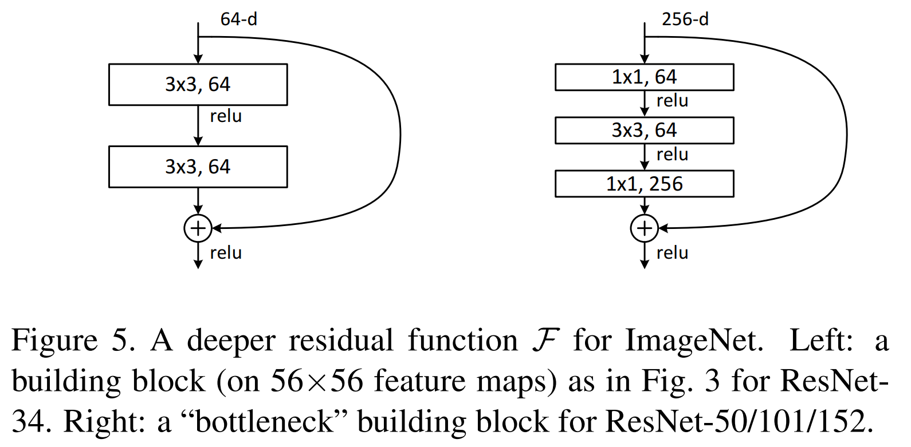
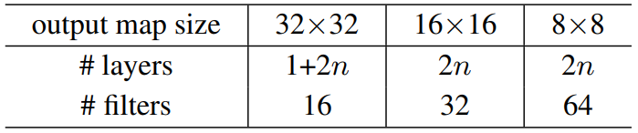
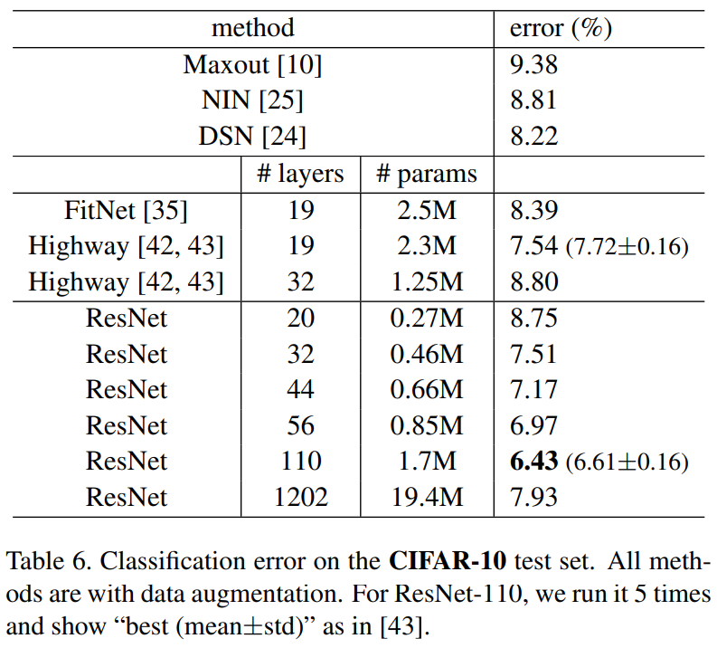
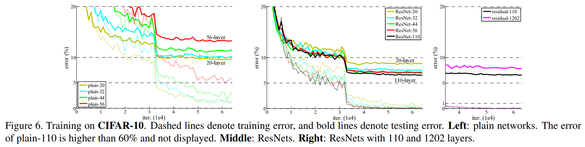
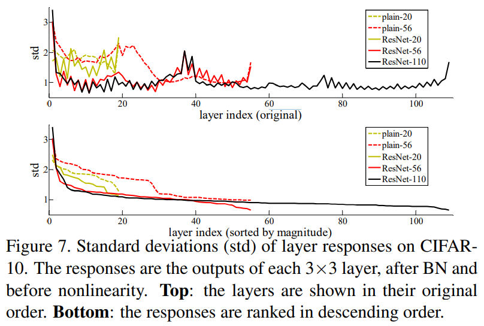
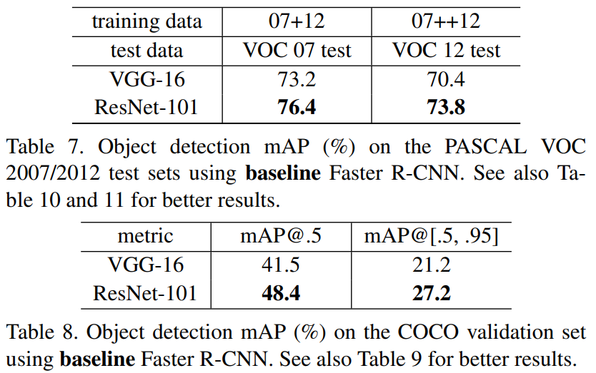

# Week 3 ResNet论文笔记+复现

论文地址：

-   本地（做了标记）[Deep Residual Learning for Image Recognition](../papers/Resnet.pdf)
-   原地址[Going deeper with convolutions](https://arxiv.org/pdf/1512.03385.pdf)

上期回顾：[Week 2 GoogLeNet](../Week2-GoogLeNet/Week 2 GoogLeNet.md)

下期预告：[Week 4 DenseNet](..\Week4-DenseNet\Week 4 DenseNet.md)

**Kaiming He**, Xiangyu Zhang, Shaoqing Ren, **Jian Sun**

Microsoft Research

## Abstract

​		开头第一句话就直指本文的核心：**深度神经网络通常难以训练。**为了解决这个问题，作者推出了残差结构，使得深度远大于当前网络的神经网络更加容易训练。**通过显式地构造残差结构，能使得网络中每一层的目标转为学习输出与输入之间的差值，即残差，而非直接学习输入到输出的映射。**通过实验，作者证明了这种网络要比没有残差结构的"plain network"**更加易于优化**，且能够获得远甚于后者的精度。

​		在ILSVRC-2015图片分类竞赛中，作者使用的网络包含了152个层，深度几乎是VGG的八倍，但计算复杂度却仍低于VGG。多个网络的集成在测试集上获得了3.57%的top-5测试错误率，使得**ResNet成为了ILSVRC-2015图片分类任务的第一名。**

​		不仅仅是图片分类，许多其他视觉任务也能受益于网络深度的增加。由于残差结构使得构建超级深神经网络成为了可能，作者凭借此在COCO目标检测数据集上获得了28%的相对精度提升，并且**赢下了ImageNet的目标检测、COCO目标检测和COCO语义分割竞赛的第一名。**

## 1 Introduction

​		在图片分类任务中，深度卷积神经网络已经引领了几波巨大的精度提升。较大的深度使得网络能够整合图片中各个尺度和各个等级的特征。近期（当年）表现最优越的几个模型都是深度较大的网络，这也证明了**网络的深度对模型的性能有决定性的作用。**

​		在这样的背景下，人们自然要问两个问题："**Is learning better as eazy as stacking more layers?**"不幸的是，这个问题的答案是否定的。用深度换取精度的第一个重要障碍就是“梯度爆炸/梯度消失”问题。这是说，网络深度较大时，梯度从输出端回传到浅层网络需要经过很多连乘操作。若所有的连乘值都大于/小于1，最终的梯度值将会随着网络的层数加深而指数增长/衰减，使得网络崩溃/难以学习。但这个问题已经被权重初始化和归一化层极大地缓解了。

​		当深度神经网络开始收敛的时候，第二个阻碍网络获得更好性能的暗礁就会浮出水面：**退化问题**。通过评估不同层数的已经收敛的网络的性能时，作者发现，**网络层数到达一定数量时，精度开始趋于饱和**（这并不奇怪）**，最后开始快速衰减。**出乎意料的是，这并不是由过拟合造成的，因为网络的训练精度和测试精度都有衰减（过拟合代表高方差低偏差）。

​		神经网络的退化现象说明，不是所有系统的优化难度都相同。这种现象怎么解释呢？作者在下一段用了一种巧妙的方法来解释：假设有一个较浅的、没有退化现象的网络，和一个浅层网络架构和前者一模一样，但还有额外的层的较深的网络，并假设直接训练这个较深的网络会发生退化现象。

​		现在，为了提升后者的精度，可以将后者的浅层的权重全部用前者的权重代替，额外的层构造为恒等变换（由于非线性激活函数的存在，这样的结构并不能简单地构造出来 ）。经过这样的构造，**后者应当至少不会在训练集上比前者表现得更差**，因为两者的输出应当完全相同。但作者发现：**现有的优化方法无法（在合理的时间内）在此基础上找到比上述构造更优的解**，甚至无法找到和上述构造相同的解。

​		本文通过构造残差结构解决了深度网络退化的问题。假设 $\mathbf{x}$ 是输入本层的特征图，$\mathcal{H}(\mathbf{x})$ 是优化目标希望的本层网络的输出，$\mathcal{F}(\mathbf{x})$ 是本层网络定义的函数，传统的网络结构的优化目标就是 $\mathcal{F}(\mathbf{x}):=\mathcal{H}(\mathbf{x})$，但残差结构通过将输入通过跳跃连接"skip connection"直接加到输出上，使得网络的优化目标变为了$\mathcal{F}(\mathbf{x}):=\mathcal{H}(\mathbf{x})-\mathbf{x}$，加上跳跃连接后本层网络的输出就变为了 $\mathcal{F}(\mathbf{x})+\mathbf{x}$。当然，这一切的前提是**假设优化残差函数 $\mathcal{H}(\mathbf{x})-\mathbf{x}$ 比优化 $\mathcal{H}(\mathbf{x})$ 更简单。**极端情况下，假设对于这一层，恒等映射是最优的，即 $\mathcal{H}(\mathbf{x})=\mathbf{x}$，那么**让网络学习残差$\mathcal{F}(\mathbf{x}):=\mathcal{H}(\mathbf{x})-\mathbf{x}=\mathbf{0}$，即将权重全部缩减至0，也比让网络学习恒等映射 $\mathcal{F}(\mathbf{x}):=\mathbf{x}$ 要来得简单。**关于ResNet为何有用的更多解释见笔记的[3.1节](#3.1 Residual Learning)。

​		在图2所示的结构中，**跳跃连接扮演的就是恒等映射的角色**，并将输入与可学习层的输出相加，得到最终的输出。

​		与其他提高网络性能的乱七八糟trick不同，残差结构的**实现极其简单**，只需在将输出与输入相加，并且不会带来任何额外的可学习参数和超参数。

​		在ImageNet上的实验表明：

1.   具有残差结构的网络较没有残差结构的网络更易于优化，并且在同等深度下获得了**比没有残差结构的网络更低的训练误差。**
2.   具有残差结构的网络能够简单地通过增加深度来获得更好的性能。

​		作者特别提到，具有残差结构的超级深网络在ImageNet、CIFAR和COCO上都获得了极佳的结果，证明残差结构是通用的，并不局限于某一个任务或某一个数据集。

## 2 Related Work

#### Residual Representations

​		列举了一些残差表示在图像识别和其他领域的应用。

#### Shortcut Connections

​		跳跃连接的灵感来源众多。早先对训练多层感知机的一个尝试就是增加一条路径，将MLP的输入通过一个线性层，直接与MLP的输出相加。GoogLeNet中在中间层增加辅助分类器来促进梯度回传也可看做是跳跃连接的一种。Inception块内部的1\*1分支相比于其他卷积层更多的分支也可看做是一种跳跃连接。

​		作者提到，在本文研究成果的竞争者中也不乏有跳跃连接的身影。在这些网络架构中，跳跃连接是“门控”的，类似于GRU和LSTM中的门，这些门是有参数的层，门的值由参数和输入共同决定。当门接近于关闭（值接近0）时，网络结构更相似于没有残差结构的网络。但ResNet的跳跃连接始终开启，相当于门始终为1。值得注意的是，门控跳跃连接并没有在超级深的网络中表现出更优的性能。

## 3 Deep Residual Learning

​		本节原文中主要详述了Introduction中简述过的[ResNet为何有用](#3.1 Residual Learning)，[网络设计思路和具体架构](#3.3 Network Architectures)、[超参数和实现细节](#3.4 Implementation)。

### 3.1 Residual Learning

​		承[上文](#1 Introduction)假设： $\mathbf{x}$ 是输入本层的特征图，$\mathcal{H}(\mathbf{x})$ 是优化目标希望的本层网络的输出，$\mathcal{F}(\mathbf{x})$ 是本层网络定义的函数。若假设多个非线性层可以渐进地拟合任何复杂的函数 $\mathcal{H}(\mathbf{x})$，这就等价于假设这些非线性层可以渐进地拟合残差函数 $\mathcal{H}(\mathbf{x})-\mathbf{x}$。尽管根据假设，$\mathcal{H}(\mathbf{x})$ 和 $\mathcal{H}(\mathbf{x})-\mathbf{x}$ 应当都能被拟合，但难度可能有所不同。

​		正如上文所述，退化问题可以通过使得深度网络的浅层和较浅的网络参数相同，深层将 $\mathcal{H}(\mathbf{x})$ 构造为恒等映射来解决。但这终究只是一种构造方法，网络在学习时难以学出这样的结构，因为**使用非线性层学习恒等映射并非易事。**但通过跳跃连接来显式地预构造出恒等映射后，若本层网络的期望优化目标 $\mathcal{H}(\mathbf{x})$ **相比于将所有输入都映射为0来说更接近恒等映射**，即 $\mathcal{H}(\mathbf{x})-\mathbf{x}\approx\mathbf{0}$ ，那么优化残差网络的过程应当较没有跳跃连接，直接拟合原函数的过程，要更加简单。这保证了网络能更轻易地学到"几乎什么也不做"这种行为的能力。

​		这是一个保底的思想：在最坏的情况下，网络认为在这一层什么也学不到，给网络增加一个"do nothing"的选项，使得经过这一层之后性能至少不会变差。

​		引用知乎问题“Resnet到底在解决一个什么问题呢？”中[薰风初入弦的回答](https://www.zhihu.com/question/64494691/answer/786270699)来说：

>按理说，当我们堆叠一个模型时，理所当然的会认为效果会越堆越好。因为，假设一个比较浅的网络已经可以达到不错的效果，**那么即使之后堆上去的网络什么也不做，模型的效果也不会变差**。
>
>*然而事实上，这却是问题所在。“什么都不做”恰好是当前神经网络最难做到的东西之一。*
>
>也许赋予神经网络无限可能性的“非线性”让神经网络模型走得太远，却也让它忘记了为什么出发。这也使得特征随着层层前向传播得到完整保留（什么也不做）的可能性都微乎其微。
>
>因此，可以认为Residual Learning的初衷，其实是**让模型的内部结构至少有恒等映射的能力。**以保证在堆叠网络的过程中，网络至少不会因为继续堆叠而产生退化！

​		这类似《动手学深度学习》一书中作者[对ResNet为何有用的解释](http://d2l.ai/chapter_convolutional-modern/resnet.html#function-classes)：

​		假设 $f^*$ 是我们真正想要寻找的、能完美解决问题的"True Function"，而 $\mathcal{F}$ 是给定网络结构，我们用这个网络结构能够寻找到的函数的集合，$f^*_{\mathcal{F}}$ 则是在 $\mathcal{F}$ 中我们能够寻找到的最优函数，则：
$$
f^*_\mathcal{F} := \mathop{\mathrm{argmin}}_f L(\mathbf{X}, \mathbf{y}, f) \text{ subject to } f \in \mathcal{F}
$$
​		现在，如果我们增大了假设集，即扩大模型能够表达的函数的范围至 $\mathcal{F}^\prime$，我们就会自然而然地认为 $f^*_{\mathcal{F}^\prime}$ 要优于 $f^*_{\mathcal{F}}$。然而，事实并非如此。

​		更有可能出现的一种情况是：虽然网络能表示的函数的范围有所扩大，但如上图中作图所示，从 $\mathcal{F}_3$ 到 $\mathcal{F}_4$，更大的函数范围并不意味着集合中最优的函数 $f^*_{\mathcal{F}}$ 距离想要拟合的完美函数 $f^*$ 更近。

​		但是，如果扩大网络所表示的函数范围（相当于增大CNN的深度）时，新的集合至少包含旧的集合，即 $\mathcal{F}\subseteq\mathcal{F}^\prime$时，情况如何呢？正如上图中右图所示，**新的函数类包含了旧的函数类中的所有函数，所以能够保证 $f^*_{\mathcal{F}^\prime}$ 至少不会差于 $f^*_{\mathcal{F}}$。**因此，只有当较复杂的函数类包含较小的函数类时，我们才能确保提高它们的性能。

​		残差网络的核心思想是：每个附加层都应该更容易地包含原始函数作为其元素之一。**若 $f^*_{\mathcal{F}^\prime}$ 和 $f^*_{\mathcal{F}}$ 的表现确实相同，那么在嵌套的函数类中，二者一定代表着同一个函数，也即新增加的网络层的作用仅为恒等变换。**

​		更多关于为何ResNet管用的解释，可以参考以下资料：

-   [ResNet论文逐段精读【论文精读】](https://www.bilibili.com/video/BV1P3411y7nn)
-   [Resnet到底在解决一个什么问题呢？](https://www.zhihu.com/question/64494691/answer/786270699)
-   [关于跳跃连接你需要知道的一切](https://baijiahao.baidu.com/s?id=1713374544374699852)
-   [The Shattered Gradients Problem: If resnets are the answer, then what is the question?](https://arxiv.org/abs/1702.08591)
-   [Visualizing the Loss Landscape of Neural Nets](https://arxiv.org/abs/1712.09913)

### 3.2 Identity Mapping by Shortcuts

​		图2中的残差块可以用公式表示成 $\mathbf{y}=\sigma(\mathcal{F}(\mathbf{x}, \{W_i\})+\mathbf{x})$，其中 $\mathbf{x}$ 和 $\mathbf{y}$ 分别是残差块的输入和输出，$\mathcal{F}$ 是网络学习的残差函数。在图二所示的结构中，$\mathcal{F}=W_2\sigma(W_1\mathbf{x})$ 包含两个带参数的层。注意，若残差块中只有一个带参数的层，即 $\mathcal{F}=W_1\mathbf{x}$，则
$$
\mathbf{y}=\sigma(\mathcal{F}(\mathbf{x}, \{W_i\})+\mathbf{x})=\sigma(W_1\mathbf{x}+\mathbf{x})=\sigma((W_1+I)\mathbf{x})
$$
​		这与将$W_1$加上一个恒等变换再作用到 $\mathbf{x}$ 上无二，完全可以通过不带跳跃连接的网络来学习，残差结构也就失去了意义。

​		残差结构中的"$+$"代表"逐元素加法"，这就隐式要求了 $\mathbf{x}$ 和 $\mathbf{y}$ 的形状需要相同。当形状不同时，可以在跳跃连接上增加一个带权重的线性变换来将 $\mathbf{x}$ 变换到与 $\mathbf{y}$ 维度相同：$\mathbf{y}=\sigma(\mathcal{F}(\mathbf{x}, \{W_i\})+W_s\mathbf{x})$。在卷积神经网络中，这分为两种情况：输入、输出残差块的特征图高、宽不同，或通道数不同。下文会分别详述这两种情况分别有何种方法来处理。

### 3.3 Network Architectures

​		得益于跳跃连接的简单实现，残差网络和普通网络可以在超参数和计算复杂度完全一致的情况下比较性能。

##### Plain Network.

​		测试所用的普通CNN的构造主要遵循了VGG的网络构造原则：1. 主要是用3\*3卷积；2. 对于同样尺寸的输入特征图，使用相同数量的卷积核；3. 特征图高、宽减半时，通道数加倍。但与VGG不同的一点是，**本文的网络架构完全摒弃了最大池化层，下采样完全由步长stride > 1的卷积层来完成。**在卷积层的最后，使用全局平局池化层和1000个神经元的全连接层，最后送入softmax来分类。

​		值得注意的是，尽管本文所用的普通网络有34层，但计算复杂度和卷积核数量仍然比VGG-19（原文中配置E）要低。

##### Residual Network.

​		残差网络在[上文](#Plain Network.)所述的plain-34网络的基础上仅仅增加了残差连接。但当当前残差块对网络进行了下采样时，输入和输出的特征图尺寸和通道数不一致，即高宽减半，通道数翻倍，残差块的输入无法直接逐元素加到输出特征图上。

​		此时，对于通道数的增加，作者给出了三个选项：(A). 维度增加时在多出来的的通道补0；(B). **仅在维度增加时**使用一个1\*1的卷积进行升维（不带激活函数）；(C). **无论维度是否增加，在所有的残差连接上都**用一个1\*1的卷积做变换（不带激活函数）。

​		对于特征图高宽的变化，**如果采用了补0策略，则在跳跃连接时以stride=2裁剪特征图**，以适配当前块输出特征图的尺寸；**如果采用了1\*1卷积策略，则设置1\*1卷积的stride=2。**

### 3.4 Implementation

​		训练时，图片短边被缩放至服从$U(256,480)$的一个随机值，并在缩放后的图像中随机裁剪出224\*224的一块，随机翻转后逐像素进行中心化，最后对图片做和AlexNet一样的PCA色彩扰动。

​		*注：这里原文是"with the per-pixel mean subtracted"，应该是指现在一个尺寸全都一样的图片集合上对每个像素的每一个通道算出一个均值，形成一张这个图片集合的"mean picture"，再从每张图片的每个元素减去这张"mean picture"的对应像素的像素值。即图片集合的尺寸应为(#num_pics, 3, 224, 224)，再对第一个维度做平均，得到一个尺寸为(1, 3, 224, 224)的"mean picture"。*

​		*文中在这里创建了一个到AlexNet的引用，AlexNet的原文是"subtracting the mean activity over the training set from each pixel." AlexNet对训练图像的预处理中不包含任何的随机性，是将短边缩放成256后再在图片正中心裁剪出224\*224的一块，这就使得AlexNet的预处理方法能从训练集得到一个固定的224\*224训练样本集合。**问题来了：ResNet的预处理在缩放和裁剪上都带有随机性**，我不太明白这里用来计算"mean picture"的图片集合是怎么来的，是不是简单地用上述带有随机性的预处理方法对训练集的每一张图片都产生一张尺寸为224的训练样本后再在这个集合上计算均值的？这样的话对训练集计算两次"mean picture"，得到的结果应该不同啊？*

​		在每个卷积层之后都跟有一个批归一化层（BN）。普通网络和残差网络的权重初始化都是用kaiming初始化方法。

##### 	Hyperparameters

​		优化算法=SGD

​		momentum=0.9

​		weight_decay=0.0001

​		batch_size=256

​		init_lr=0.1

​		lr_scheduler=ReduceLROnPlateau

​		#iter=6e5

​		测试时，产生用于本文性能对比的测试样本是标准的[TenCrop](https://pytorch.org/vision/stable/transforms.html?highlight=tencrop#torchvision.transforms.TenCrop)；为了获得最佳的性能，产生用于提交刷榜的测试样本采用了类似VGG的测试方式：将图片短边缩放到{224, 256, 384, 480, 640}，将全连接层转化为全卷积，对空间做平均后对多个尺寸的结果做平均。

## 4 Experiments

​		本节中作者主要展示了支撑**Introduction**中各种结论的**实验结果**及网络细节上**不同选择的性能差别**，分为三个部分：[ImageNet图片分类](#4.1 ImageNet Classification)、[CIFAR10图片分类](#4.2 CIFAR-10 and Analysis)和Pascal、COCO目标检测。

### 4.1 ImageNet Classification

​		本小节的所有性能评估在ILSVRC-2012上进行。

##### Plain Networks.

​		在普通网络上评估了plain-18和plain-34网络的性能。没有跳跃连接的网络表现出了明显的退化现象：plain-34比plain-18有更高的训练误差和测试误差，即使从理论上来说plain-18能表示的函数仅是plain-34的一个子集。

​		由于BN层的存在，前向传播的激活值和反向传播的梯度都是健康的值，所以这样的退化问题不像是由梯度消失引起的。

##### Residual Networks.

​		用于与普通网络进行性能对比的残差网络仅在其基础上增加了跳跃连接，并且所有特征图尺寸发生改变的地方都使用额外通道补0的策略来处理，所以有无残差结构的网络的参数数量应当完全相等。

​		拥有跳跃连接的34层网络ResNet-34表现出了比ResNet-18更低的训练误差和测试误差，这表明残差结构可以很好地解决模型退化问题，并且拥有残差结构的网络可以简单地通过堆叠新层来提高性能。

​		容易忽略的一点是，plain-18和ResNet-18的性能相似，但ResNet-18的收敛速度要快于plain-18。这说明在网络较浅，退化问题尚未出现或尚不显著时，能在早期加速网络收敛的进程。

##### Identity v.s. Projection Shortcuts.

​		上面两部分展示了没有参数、补0策略的跳跃连接对网络性能的提升作用，下面讨论使用了1\*1卷积来在特征图尺寸改变时提升维度的策略的优劣。

​		回忆[上文](#Residual Network.)提到过的特征图尺寸改变时，跳跃连接的三个实现策略：(A). 尺寸改变时在多出来的的通道补0；(B). **仅在维度增加时**使用一个1\*1的卷积进行升维（不带激活函数）；(C). **无论维度是否增加，在所有的跳跃连接上都**用一个1\*1的卷积做变换（不带激活函数）。表3显示了这三个选项的性能区别：C略好于B，B略好于A。作者推断前者的性能提升是额外的参数带来的。但由于这三个选项的性能差别如此之小，并且策略C会带来一些额外的参数和计算复杂度，作者决定在下文的性能评估中**弃置策略C**。并且在下文所要介绍的瓶颈结构和更深的ResNet中，放弃策略C将会节省大量的计算复杂度和参数量。

##### Deeper Bottleneck Architectures.

​		接下来介绍适用于ImageNet的更深的模型。由于训练时长有限，在更深的模型中作者将残差结构修改成为"瓶颈结构"。作者特意在脚注中说明：非瓶颈结构的深度残差网络同样也能从更大的深度中受益，修改为瓶颈结构主要是出于实用目的。

​		瓶颈结构上图所示，由3而不是2个层组成：1\*1卷积、3\*3卷积和1\*1卷积。第一个1\*1卷积的作用于GoogLeNet中相似，都起到降低通道数，减少计算量的作用，即"dimension reduction"，而第三个1\*1卷积负责增加（重建）通道数，使得输入和输出特征图通道数相等。

###### 	50-layer ResNet.

​		用有3个层的瓶颈结构代替ResNet-34中只有2个层的块之后，就得到了ResNet-50。

###### 101-layer and 152-layer ResNets.

​		仅仅就是叠加了更多瓶颈结构的残差块。值得注意的是，ResNet-152的计算复杂度仍比VGG-16/19要低。从表4中可以看到，从ResNet34到152，模型的精度不断提升，并且没有观测到任何退化现象。

##### Comparisons with State-of-the-art Methods.

​		ResNet-152**单模型**的top-5错误率为4.49%，低于表5中所有其他模型的集成错误率！集成了6个深度不同的模型后，作者最终在ILSVRC-2015上得到了3.57%的top-5错误率，赢下了第一名。

### 4.2 CIFAR-10 and Analysis

​		CIFAR-10的训练集包含50k张图片，测试集包含10k张图片，每张图片都为32\*32的RGB彩色图片，共分为10类。作者强调，在CIFAR-10上实验的目的主要是研究极深神经网络的行为，并非冲击新的记录，所以在这里使用了相对简单的网络结构。

​		网络结构如上表所示。残差连接全部使用策略A，即对多余的通道补0，因此ResNet和plain的宽度、深度、参数量都完全相同。数据增强方面，同样是从每张图片中减去了"mean picture"，在每张图片的周围pad上4个像素，并随机在pad后的图片中裁剪出32\*32的一块，并随机水平翻转。测试时，除了像素中心化，不做其他预处理。

​		weight_decay=0.0001，卷积后面跟了BN层，没用Dropout，batch_size=128，lr=0.1，在32k和48k迭代时将学习率乘以0.1。

​		作者分别设置了n={3, 5, 7, 9, 18}，得到了plain-20, 32, 44, 56和ResNet-20, 32, 44, 56, 110。意料之中，plain同样表现出了和在ImageNet上一样的退化现象，而ResNet的精度随着深度的增加则不断上涨。

##### Analysis of Layer Responses.

​		上图展示了plain和ResNet各3\*3卷积层的响应值（BN层的输出，在逐元素相加和ReLU之前）。对于ResNet来说，响应值的强度就代表了残差的大小。图7中下面的图片显示出相比于plain网络，ResNet的响应值更小，这印证了[上文](#3.1 Residual Learning)的假设"本层网络的期望优化目标 $\mathcal{H}(\mathbf{x})$ **相比于将所有输入都映射为0来说更接近恒等映射**"。

​		作者注意到，随着ResNet的加深，每层的响应值将会更小，这意味着每层网络倾向于对前向传播的信号做更微小的修改。

##### Exploring Over 1000 layers.

​		n=200时，得到的网络是ResNet-1202，训练误差<0.1%，测试误差为7.93%，过拟合相当严重，但测试误差也不算高。作者没有用任何正则化方法，因为实验目的是专注于深度网络的优化困难的问题。

### 4.3 Object Detection on PASCAL and MS COCO

​		看图

## 总结

​		这篇文章没有结论，因为CVPR要求正文不多于8页。这篇文章最大的特点就是Introduction把东西差不多都说完了，看完Intro差不多就了解整篇文章的动机、思路、方法和结果了。后面几节的表述也确实详细，除了"mean picture"那一部分之外基本没有很难懂的地方，就是关于ResNet为什么管用的解释还需要查询更多资料才能够形成自己的理解。

### 贡献

​		提出了残差结构，使得构造超级深神经网络成为可能；让深度学习模型在ImageNet图片分类任务中超越了人类的水平。

### 动机

​		观察到深层网络表现出退化现象，既不是由过拟合引起也不是由梯度消失/爆炸引起；在其他领域中，跳跃连接和残差表示已有先例。

### 结构

​		普通残差块：3\*3 Conv → 3\*3 Conv

​		瓶颈残差块：1\*1 Conv → 3\*3 Conv → 1\*1 Conv

​		三种策略：

​			(A). 维度增加时在多出来的的通道补0；

​			(B). 仅在维度增加时使用一个1\*1的卷积进行升维（不带激活函数）；

​			(C). 无论维度是否增加，在所有的残差连接上都用一个1\*1的卷积做变换（不带激活函数）。

### 预处理

##### 	ImageNet

​		训练：缩放至服从$U(256,480)$的一个随机值，随机裁剪224\*224，随机翻转，中心化，PCA色彩扰动。

​		测试：TenCrop或将图片短边缩放到{224, 256, 384, 480, 640}后全卷积。

##### 	CIFAR

​		训练：pad4个像素，随机裁剪32\*32。

​		测试：不作任何预处理。
