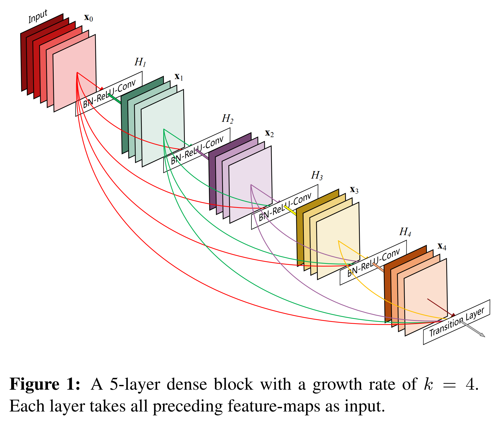
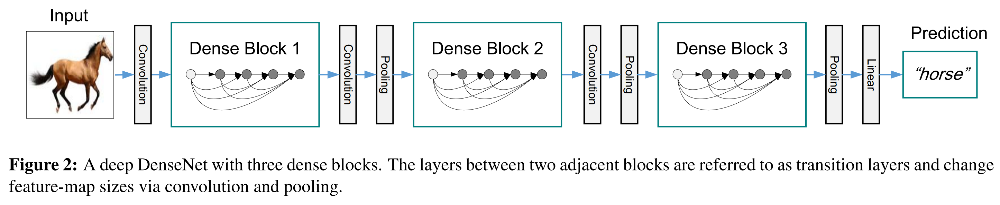
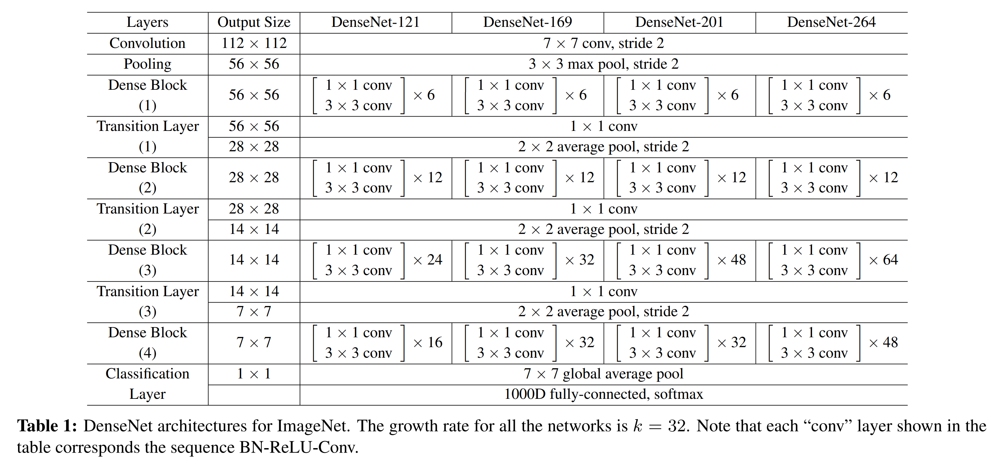
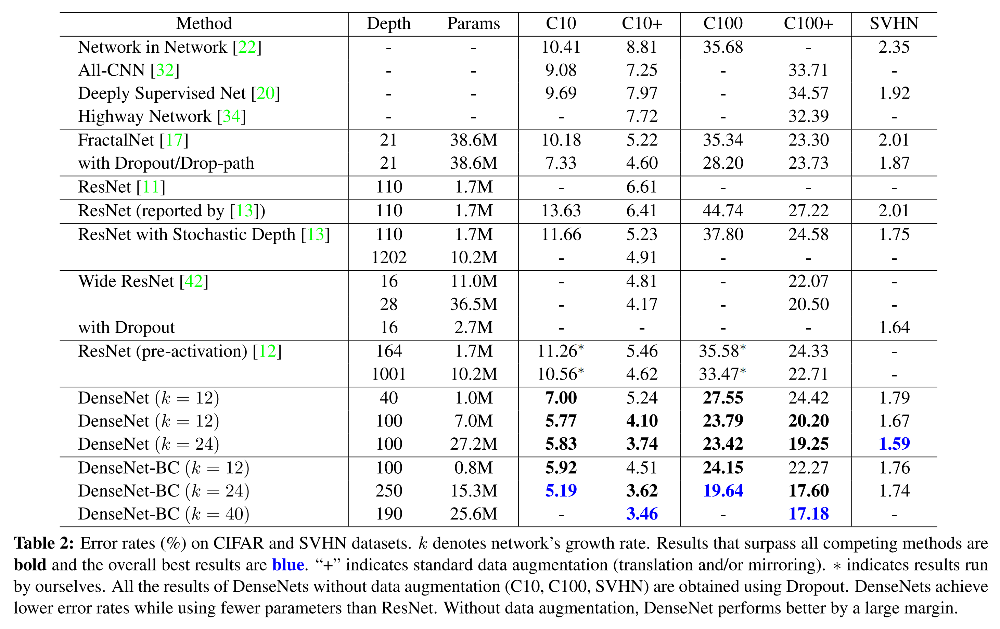
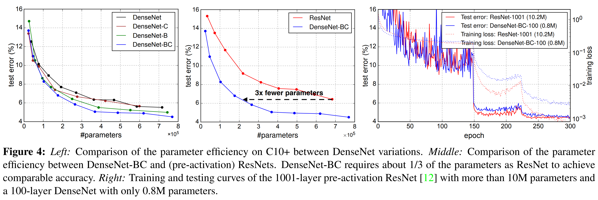
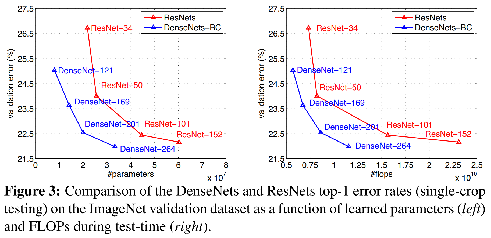
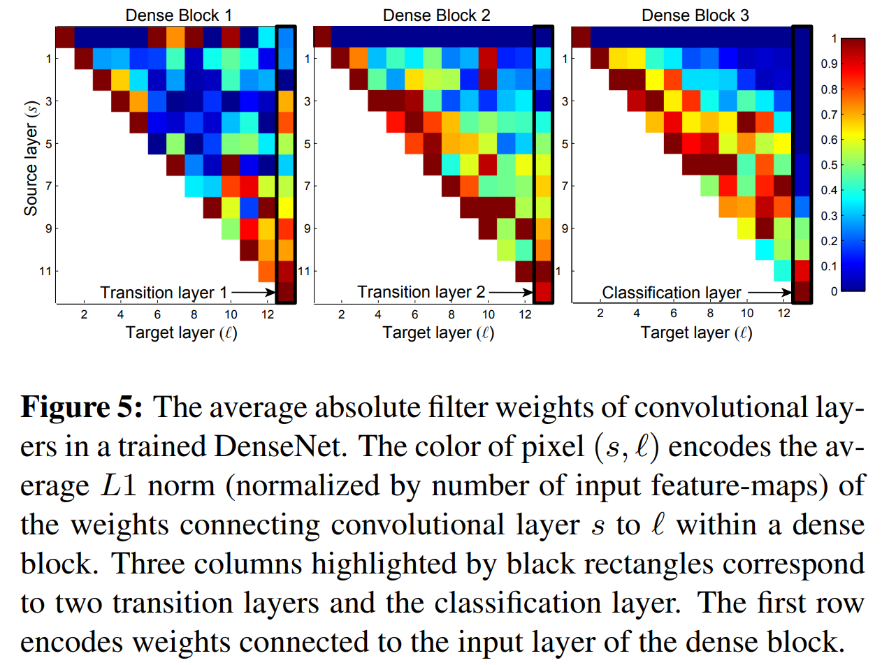

# Week 4 DenseNet论文笔记+复现

论文地址：

- 本地（做了标记）[Densely Connected Convolutional Networks](../papers/DenseNet.pdf)
- 原地址[Densely Connected Convolutional Networks](https://arxiv.org/pdf/1608.06993.pdf)

上期回顾：[Week 3 ResNet](..\Week3-ResNet\Week 3 ResNet.md)

## Abstract

​		得益于跳跃连接，CNN的深度、精度和训练效率都得到了大幅度地提升。本文提出了DenseNet，将网络的各层**稠密地向前连接起来**。在网络的一层中，所有之前的层的特征图都被当做本层的输入，而本层输出的特征图又作为所有之后的层的输入。这样的网络架构解决了梯度消失问题，强化了特征的前向传递，鼓励特征重用，并且大幅度地减少了参数的数量，使得能够以更低的计算复杂度在CIFAR-10、CIFAR-100、SVHN和ImageNet上取得优秀的结果。

## 1 Introduction

​		CNN的深度越来越大时，会出现梯度消失或梯度相关性减弱的问题。以ResNet为首的许多工作都解决了这一问题，核心的思路大致无异：**将浅层网络和深层网络用跳跃连接连接起来**。

​		本文中，作者用将这个思路实现为了一个简单的连接模式：将网络的一层与其后的所有层连接起来。若网络有$L$层，则共有$\frac{L(L+1)}{2}$个跳跃连接。但本文的跳跃连接与ResNet的不同之处在于，**所有的连接都以张量拼接的方式实现，而不是ResNet中的逐元素相加。**

​		*这图画得真不错，看一眼再结合Introduction，5分钟就大致搞懂这论文在干嘛了。*

​		传统的前馈网络可以看成一个带有隐藏状态的算法，经过网络的一层，一部分信息得以保留，一部分信息被修改。ResNet通过显式地构造恒等变换，将保留和修改分离开来。而DenseNet的做法则是使每一层的输入包含了本DenseBlock（下文详述）的输入特征图和从本块第一层到当前层之间所有层对特征图所做修改的结果。

​		DenseNet有一个反直觉的事实：它的**参数数量反比传统结构的CNN要少**。这是由于DenseNet的网络宽度很小，**每层仅有12个卷积核**，仅在当前输入特征图的末尾拼接上少量额外的通道。

​		并且，这样的结构也**为梯度的反向传播提供了便利**，因为跳跃连接使得每一层都能直接从最后的分类层获得梯度，也能把梯度直接传播给前面更浅的层。作者还发现这种层与层之间的稠密连接方式**有正则化效果**。

​		

## 2 Related Work

​		Highway Networks是第一个探索了以端到端的方式训练100层以上的网络，其中新增的门控残差连接使得数百层的网络的训练优化更加简单。这一点在ResNet中得到了更加淋漓尽致的体现，但ResNet使用的是纯粹的恒等映射，去除掉了门控单元，并在各个竞赛中成为了SOTA。但回忆[ResNet](../Week3-ResNet/Week 3 ResNet.md)，网络在n=200，#layer=1202时在CIFAR10上出现了过拟合的问题，随后随机深度网络通过随机丢弃网络的一些层从而改善了训练的过程，并且证明了ResNet中不是所有层都是必须的，其中存在大量冗余的层。这一洞见也成为了激发作者设计出本文网络结构DenseNet的灵感来源。

​		除了增加深度，近年来对提高网络性能的另一途径——增加网络的宽度的探索，也从未停止。[GoogLeNet](..\Week2-GoogLeNet\Week 2 GoogLeNet.md)通过设计Inception块，在块中使得输入特征图经过多条路径之后在通道维拼接后输出，在参数量和计算复杂度较小的情况下实现了网络宽度的提升。

​		本文的思路与上述工作不同，是通过 *特征重用* 来增加挖掘出网络的表达能力，这样的网络结构不仅容易训练，还更加"parameter-efficient"，即能在更少的参数量下表现出更优的性能。虽然DenseNet在特征图拼接这方面与GoogLeNet相似，但在网络设计原则上更加简单，超参数空间较小，同时有更高的参数效率。

## 3 DenseNets

​		约定网络的第 $l$ 层用 $H_l(\dotproduct)$ 表示，是BN、ReLU和卷积层的复合，输入特征图为 $\mathbf{x}_{l-1}$。

##### ResNets.

​		对于传统网络来说，$\mathbf{x}_l=H_l(\mathbf{x}_{l-1})$。ResNet在此基础上加入了跳跃连接，使得 $\mathbf{x}_l=H_l(\mathbf{x}_{l-1})+\mathbf{x}_{l-1}$，这样做能使得梯度绕开本层，通过恒等变换直接从深层流向浅层。但ResNet以加法的方式实现信息融合，这可能会对信息的传递造成不良影响。

##### Dense connectivity.

​		正如图1所示，DenseNet中后面的层接受所有层的输出作为输入：$\mathbf{x}_l=H_l([\mathbf{x}_{0},\mathbf{x}_{1},...,\mathbf{x}_{l-1}])$。其中的中括号代表特征图在通道维的拼接。

##### Composite function.

​		和之前常用的**3\*3Conv$\longrightarrow$BatchNorm$\longrightarrow$ReLU**不同，这里的基本单元使用了和ResNet-v2相同的"pre-activation"，即$H_l(\dotproduct)=$**BatchNorm$\longrightarrow$ReLU$\longrightarrow$3\*3Conv**。

##### Pooling layers.

​		为了缩减特征图的尺寸，网络被设计成几个Dense Block中穿插下采样**平均池化层**：**BatchNorm$\longrightarrow$1\*1Conv$\longrightarrow$2\*2AvgPool**。

##### Growth rate.

​		**引入一个全新的超参数：Growth rate** $k$，即每个3\*3卷积层新产生 $k$ 个特征图或每个3\*3卷积层有 $k$ 个卷积核。由此，本DenseBlock第 $l$ 层网络的输入特征图通道数应为 $k_0+k\times(l-1)$，其中 $k_0$ 为本块输入特征图通道数。DenseNet与现存其他网络结构一个重要的不同是，**DenseNet可以设计得非常窄，如** $k=12$。经过测试，这样的选择也足以使网络获得非常好的性能。作者对这个现象做了解释：每个卷积层都能直接访问到本块中之前所有层的特征图并产生一些新的特征图，这些特征图包含了"collective knowledge"(意为"a large number of individuals contribute their knowledge and skills to a group")，是本层综合了前面所有层的输出而提取出的信息，而最后一层更是以网络所有层的输出作为输入，综合了不同层面的特征来作出分类。

​		超参数 $k$ 控制了每个卷积层对全局信息"global state"贡献的多少。"global state"在本层被写入，在本块之后的任意一层都可被访问。

##### Bottleneck layers.

​		尽管增长率 $k$ 已经被设置得较小，但对于较深的DenseNet来说，位于深度较大的部分的卷积层的输入特征图通道数还是较为庞大。正如ResNet和GoogLeNet都曾使用过的，1\*1卷积层可以有效地减少计算量并降低通道数，所以作者额外地将原始的基本结构$H_l(\dotproduct)=$**BN$\longrightarrow$ReLU$\longrightarrow$3\*3Conv**修改为$H_l(\dotproduct)=$**BN$\longrightarrow$ReLU$\longrightarrow$1\*1Conv$\longrightarrow$BN$\longrightarrow$ReLU$\longrightarrow$3\*3Conv**，其中1\*1卷积层的输出通道数恒为 $4k$。

​		以瓶颈结构替换上文基本结构的网络记为DenseNet-B。

##### Compression.

​		为了进一步提升模型的紧凑性，作者在下采样部分也增加了1\*1卷积以实现通道的压缩。**引入了一个全新的超参数：compression factor** $\theta\in(0,1]$，每个下采样层中的1\*1卷积层的输入通道数为 $m$，输出通道数为$\left \lfloor \theta m \right \rfloor $。

​		下采样层中1\*1卷积层的 $\theta<1$ 的网络记为DenseNet-C；$\theta<1$ 且带有瓶颈结构的网络用DenseNet-BC。

##### Implementation Details.

​		在CIFAR-10、CIFAR-100和SVHN的实验中，三个DenseBlock拥有同样数量的卷积层。在第一个DenseBlock之前，原始图像先经过一个卷积层，输出通道为16（或$2k$，对于DenseNet-BC）。在最后一个DenseBlock之后，应用一个全局平均池化层，再接一个全连接层最后送入Softmax层产生输出。三个DenseBlock的输出特征图尺寸分别为32\*32、16\*16、8\*8。普通DenseNet中，配置有$\{L=40,k=12\}$、$\{L=100,k=12\}$和$\{L=100,k=24\}$；DenseNet-BC中，配置有$\{L=40,k=12\}$、$\{L=250,k=24\}$和$\{L=190,k=40\}$。

​		在ImageNet的实验中，网络包含4个DenseBlock，第一个DenseBlock前用一个7\*7、步长为2的卷积层将通道数变为$2k$。具体配置见下图：

## 4 Experiments

### 4.1 Datasets

##### CIFAR.

​		数据集后面带了加号的是应用了数据增强的实验，增强方法是水平翻转、偏移。数据预处理为对三个通道用均值和标准差做标准化。训练时在训练集中流出10%（5000张）当做验证集用来挑选超参数，最终用于报告精度的模型是在全部50000条训练数据上训练而来。

##### SVHN.

​		Street View House Numbers(SVHN)中的图像是32\*32的彩色数据图像。训练集共73257张，测试集中26032张，额外训练数据531131张。对于此数据集不应用数据增强，仅将像素值除以255使得像素值在$[0,1]$之间。

##### ImageNet.

​		在ImageNet上的实验中，数据增强使用和ResNet中相同的做法。测试时，使用标准的TenCrop。

### 4.2 Training

​		**优化算法：**SGD

​		**初始学习率：**0.1

​		**学习率调整：**StepLR。CIFAR、SVHN：在50%和75%时学习率除10；ImageNet：在33%、67%时除10

​		**epoch数：**CIFAR：300；SVHN：40；ImageNet：90

​		**batch size：**CIFAR、SVHN：64；ImageNet：256

​		**weight decay：**1e-4

​		**Nesterov Momentum：**0.9

​		**Dropout：**对于非DenseNet-BC的普通DenseNet，在每个卷积层后追加一p=0.2的dropout

### 4.3 Classification Results on CIFAR and SVHN

​		精度超过其他所有工作的数值用粗体标注，最佳精度用蓝色标注。

##### Accuracy.

​		$\{L=190,k=40\}$，有数据增强加持的配置力压群雄，不仅击败了所有其他模型，在DenseNet的内部横向对比中也绝对领先。值得注意的是，最后一行SVHN的测试中，$\{L=250,k=24\}$的模型不敌相对较浅的$\{L=100,k=24\}$，这种过拟合现象与SVHN分类任务较为简单有关。

##### Capacity.

​		从不用瓶颈结构、DenseBlock之间不缩减通道数的普通DenseNet的表现来看，网络性能也受益于$L$和$k$的增大，作者认为这样的性能提升是由于网络容量的增加带来的，这说明DenseNet的确能从网络深度的增加获得更强的表达能力。

##### Parameter Efficiency.

​		纵观表2中个模型的参数数量和精度，不难发现DenseNet的参数利用效率要明显高于其他模型，其中DenseNet-BC更甚。参数数量仅有0.8M的$\{L=100,k=12\}$DenseNet-BC的精度甚至超过了参数量超过10M的ResNet。

##### Overfitting.

​		更大的参数利用效率也意味着网络更难过拟合。在未做数据增强的实验中，DenseNet也表现出了更强的性能。唯一观测到的过拟合现象是，在未做数据增强的CIFAR-10数据集上，将$k=12$提升至$k=24$带来的4倍参数量提升使得错误率从5.77%提高到了5.83%，但加入瓶颈结构和下采样通道缩减后，网络没有出现任何的过拟合现象。

### 4.4 Classification Results on ImageNet

​		在ImageNet上的评估中，作者将所有超参数设置为与ResNet完全相同（除了网络架构相关的超参数），以保证最大的比较公平性。

​		上图展示了ResNet和DenseNet在不同的参数数量和计算复杂度下的top-1验证错误率。可以看到，达到相同的精度，DenseNet所需的参数数量和计算复杂度都远小于ResNet，尤其是DenseNet-201，仅需略大于ResNet-50的计算复杂度即可达到复杂度约为其两倍的ResNet-101的性能。

​		作者再一次强调：本节的实验均在超参数和ResNet设置完全一样的情况下进行。若专为DenseNet优化超参数，则可能得到更优的结果。

## 5 Disscussion

​		大致来看，DenseNet和ResNet的跳跃连接非常相似，仅仅是将逐元素相加改成了特征图拼接。但事实表明，这一小小的修改导致了二者网络行为的巨大差异。

##### Model compactness.

​		以特征图拼接实现跳跃连接的一个直接的结果就是，每一层都能获得之前所有层未经修改的原始输出，这**鼓励了本层结合新增的特征图对更浅的层输出的特征重新分析**，即特征重用，也提升了模型的紧凑性。

​		由于使用了"pre-activation"的ResNet在精度和参数利用效率上都远超AlexNet和VGG，故作者选用其与DenseNet($k=12$)做对比。图4中的左图显示出DenseNet-BC的参数利用效率最高，即在相同的参数数量下性能最优，性能相同的情况下参数最少，几乎是ResNet(pre-activation)的$1/3$。

##### Implicit Deep Supervision.

​		作者在这一节给出了为何DenseNet的精度有所提升的一个解释：每一层经过跳跃连接都能从损失函数获得额外的梯度。这类似于deeply-supervised nets(DSN)，每一个隐藏层后都接一个辅助分类器，从而使得每一个隐藏层都能直接获得梯度。

​		DenseNet与DSN不同的是，DenseNet用跳跃连接隐式地实现了deep supervision：**每一个卷积层都能"直接"获得梯度，仅需经过2到3个下采样层，并且仅需网络末端的一个损失函数即可。**这使得网络的损失函数的结构不像DSN那样复杂，并且能实现类似的效果。

##### Stochastic vs. deterministic connection.

​		在对ResNet的修改：stochastic depth方法以一定的概率随机丢弃每个卷积层（池化层不被丢弃），这使得两个池化层之间的某两个卷积层都会以较小的概率直接连接，如果这两个卷积层之间的所有层都被丢弃。这个思路看上去与DenseNet截然不同，但也为DenseNet为何成功提供了解释思路：网络如果认为中间的某一层没有作用，其下一层可以通过将卷积核对应通道的值置0来忽略该层的行为，仅使用其之前的层的输出。

##### Feature Reuse.

​		本文曾多次提到DenseNet优良的性能可能是由于网络结构设计鼓励特征重用而导致的，作者对此做了实验：在CIFAR-10+上训练了一个$\{L=40,k=12\}$的DenseNet，随后**统计了三个DenseBlock各卷积层的所有卷积核在前面各层输出的特征图上的权重平均绝对值大小**，如图5所示。图像$(l, s)$位置的红色色块代表本DenseBlock的第 $l$ 层的卷积核在其之前的第 $s$ 层输出的特征图上的权重很大。图像的**第一行**代表了各层的卷积核在本DenseBlock的输入特征图上的权重，**最后一列**代表本块后的下采样层的卷积核在本块各层输出的特征图上的权重。

从图中可以看出：

1.   一个DenseBlock中较深的层确实会直接使用较浅的层输出的特征图；
2.   一个DenseBlock末尾的下采样层也会使用本块各层输出的特征图；
3.   第2、第3个DenseBlock除第一层外的各层在本块之前的下采样层输出的特征图上的权重一直较小。这也说明**特征图通道维不做缩减 ($\theta=1$) 的下采样层输出的特征图有较多冗余**，这也驱动了作者引入 $\theta$ 这一超参数来对输入下采样层的各个特征图进行融合；
4.   第三个DenseBlock后的分类层更加专注于该块靠后的层的特征图，这也许说明了较深的层提取出了语义性较强的高级特征。

## 6 Conclusion

​		本文提出了DenseNet，将同一个DenseBlock中的各个卷积层稠密地连接起来，这样的结构能轻易地堆叠出上百层的网络，而不会遇到严重的优化问题。随着网络参数数量的增加，网络的精度稳步增长，并且没有观测到明显的退化和过拟合问题。另外，DenseNet能够在更少的参数数量和更低的计算复杂度下达到SOTA的效果。

​		本文所做的所有实验均使用了和ResNet相同的超参数设置，若专门为DenseNet优化超参数，应当能得到更好的结果。

​		DenseNet通过实现这一简单的连接原则，自然地融合了跳跃连接、恒等变换、深度监督和多元梯度的各种优点。并且由于DenseNet特征重用的特性和超参数 $\theta$ 的引入，使得**网络的结构更加紧凑的同时精度更高，也意味着网络能够在一层中融合各个等级的特征来提取出更加丰富、精炼的信息，**为DenseNet成为优良的特征提取器提供了优良的前提条件。
