# Week 5 Transformer论文笔记+实现

论文地址：

- 本地（做了标记）[Attention is All You Need](..\papers\Attention Is All You Need.pdf)
- 原地址[Attention is All You Need](https://arxiv.org/pdf/1706.03762.pdf)

上期回顾：[Week 4 DenseNet](..\Week4-DenseNet\Week 4 DenseNet.md)

## 简介

​		这篇论文可谓是Transformer和注意力机制大红大紫、真正火出圈的奠基之作，它的实现也是我，一个初学者，对NLP领域的第一次尝试。整个撰写论文笔记和代码实现的过程不可谓不坎坷。考虑到许多小伙伴也和作者一样，对NLP几乎一无所知，那么这篇文章我们就捋一捋NLP领域序列转录任务中，从CNN、RNN到Transformer和它的核心——注意力机制及其引入过程——同时也是我的学习过程，分别介绍之后再来进入原论文的精读，尽量避免让大家像我一样由于预备知识的不足而辗转于各种《一文读懂xxx》最终陷入递归式的学习，希望能为和我一样的初学者对学习Transformer提供一些帮助。

​		本文对RNN、编码器-解码器、seq2seq和注意力机制的介绍大量参考了李沐老师等人所著[《动手学深度学习》](https://zh.d2l.ai)中的内容，关于Transformer中各个模块的解读也查阅了大量网络资料，已一一列举在[参考资料](# 参考资料)中。

​		另外强力推荐台大李宏毅老师《机器学习》课中[Transformer的部分](https://www.bilibili.com/video/BV1Wv411h7kN)，简洁清晰，看一遍视频再看一遍原论文，胜过所有解读文章。

​		原论文地址：https://arxiv.org/pdf/1706.03762.pdf

## 预备知识

#### 序列转录

​		输入一个序列$\mathbf x=(x_1,\dots,x_n)$，输出另一个序列$\mathbf y=(y_1,\dots,y_m)$的任务称为转录（transduction），常见例子有生物学中蛋白质的转录、深度学习中的机器翻译NMT等。在下文中，用$n$代表输入序列的长度，用$m$代表输出序列的长度。对于本文来说，要解决的任务就是机器翻译，所以$n$代表了输入句子的词元的数量，$m$代表了输出句子词元的数量。

#### 词嵌入

​		正如上文所述，本文中我们的任务是将一个句子转化成另一种语言的对应句子。但句子在处理之前，首先需要被转化成计算机可以理解的形式。将一个句子 $\mathbf x$ 分解成一系列基本组成元素 $x_1,x_2,\dots,x_n$，称为tokenize。英语中，常将每个单词作为一个token，或将每个单词以词根、后缀的形式分割成子词subword，将每个subword作为一个token。中文中，常将一个字或一个词作为一个token。

​		分词之后，再将每个token用一个固定长度的列向量来表示，这个**从token到实向量的映射过程称为词嵌入Embedding**。这样，**一个句子中的所有token横向拼接起来就能表示为一个矩阵** $\mathbf x\in\mathbb R^{d\times num\_token}$，行数为词向量的长度，列数为一个句子中包含token的个数。

​		实际处理中，我们通常会并行处理许多句子，就需要将许多个句子矩阵拼接成一个张量。在拼接之前，需要统一所有句子的长度，长句子中超过规定长度的token被截掉，小于规定长度的句子末尾会被填充一个特殊的token：**\<pad\>**，直至长度等于规定长度。这样，就能把一个批量的句子拼接成一个三维张量。

​		词嵌入通常作为自然语言处理模型中的一个模块存在，其中每个词元对应的向量都是可学习的参数，会随着网络的反向传播迭代更新而不断变化。

#### Softmax函数

​		上文介绍的词嵌入给出了将词元转化成向量的方法，但我们的模型通常不能直接输出词元，只能输出一个维数与总词元数量相等的长向量，将其中的数值归一化，并看做网络认为此处应当输出该词元的概率。随后，简单地取数值最大的位置对应的词元就能实现从向量到词元的转化。

​		事实上，Softmax不仅被用在机器翻译领域中，而是一个在机器学习的多分类任务中常用的函数，能够将一组实数转化为一组处于0到1之间、和为1的权重，同时不改变各个元素的大小顺序：
$$
\mathbf x=[x_1,x_2,\dots,x_n]
\\
\mathrm{softmax}(\mathbf x)=[\frac{e^{x_1}}{\sum_{i=1}^ne^{x_i}},\frac{e^{x_2}}{\sum_{i=1}^ne^{x_i}},\dots,\frac{e^{x_n}}{\sum_{i=1}^ne^{x_i}}]
$$
​		由于指数函数增长较快，实际使用中，为避免数值上溢，通常计算$\mathrm{softmax}(\mathbf x-\max{x_i})$。

​		分类任务中，给定输入 $\mathbf x$，通常将网络的输出 $\mathbf z$ 送入Softmax，把Softmax的输出看做网络在某一个样本上对各个类别的置信度或后验概率 $P(class_i|\mathbf{x})=\mathrm{softmax}(\mathbf z)_i$。

#### 卷积神经网络

​		卷积神经网络（CNN）是将卷积层作为基本模块的一类神经网络，常用于处理2D图像信息，但在自然语言处理中也有应用。具体来说，卷积神经网络的基本模块是卷积层，卷积层包含一系列卷积核（核函数），卷积核中的每个元素都是可学习的参数。一次卷积操作是指**将卷积核"覆盖"在输入张量的一个小区域上，对应元素相乘后相加**，得到一个新的值。将卷积核在输入张量上移动时，对每个位置进行一次卷积操作，就能得到不同的值，遍历输入张量所有的位置就可得出一个新的张量。

​		适用于序列信息的卷积称为1D卷积，输入和输出都是向量，卷积核也是一个向量，如下图所示：

​		其中横向为时间轴。若每个时间步输入的是长度大于1的向量（例如下图中，每个词元对应的词嵌入向量长度为4），为了保证对应元素能够相乘，则卷积核的长度应当与词嵌入向量的长度相等，就能够实现将**一串向量**转化为**一个向量**：

​		相似地，在机器翻译任务中我们希望**每个词向量**通过卷积层输出之后仍然是向量而不是标量，这就需要同一个卷积层中包含多个卷积核：

​		综上，卷积层的卷积核数量决定了卷积层输出向量的长度，而其中每个卷积核的长度由输入词向量的长度决定。

​		这样，就将一个词的词嵌入向量的信息和周围几个（具体数值取决于卷积核的大小）词的信息融合了起来，可以认为输出序列中的单个输出向量包含了周围一些向量的信息，而不是像原始输入那样相互独立、互不影响的。

​		这样堆叠多个卷积层，每一个输出向量就包含了周围数个向量的信息，将其融合后整合成一个新的向量，是序列信息常用的一种特征提取方法。但卷积层的卷积核大小、步长、卷积层数量固定之后，每一个输出向量所融合的信息的范围也就固定了，并且仅仅局限在当前输出向量所在时间步的前后周围，这**不利于模型学习时间间隔稍长的元素之间的关系。**

​		对应到机器翻译任务中，相当于卷积层在处理当前词时仅仅参考了周围几个词的信息，而没有参考卷积核覆盖范围之外的词的信息。例如，若句子的主语在句子开头就已经指定，但经过数个卷积层之后，在句子末尾的向量很可能仍然不包含主语的任何信息（性别、单复数等）。

​		注意到每次卷积都会使得单个输出包含左右更大范围的信息，例如若一层卷积的卷积核大小为3，则两层卷积堆叠起来就能融合到当前词元周围共5个词元的信息。若想学习到句子开头、结尾之间的因果关系，则需要堆叠大量卷积层才能做到。

#### 循环神经网络

​		循环神经网络不同于卷积神经网络，拥有"记忆"功能，并且显式地从序列的一段开始，向另一端逐步处理，可以对稍长时间间隔的元素之间的关系进行建模。

​		循环神经网络（RNN）本质上是一个Moore状态机(即输出仅取决于当前时刻的状态，不直接取决于输入)，用隐状态hidden state(一个向量) $\mathbf h_t$ 来存储时序信息。在每个时间步，RNN用上一时刻的隐状态和本时刻的输入，来更新隐状态：$\mathbf{H}_{t}=f(\mathbf{H}_{t-1}, \mathbf{x}_t)$，然后用本时刻的隐状态来计算本时刻的输出：$\mathbf{y}_t=g(\mathbf{H}_t)$。初始时刻的隐状态通常用零向量或高斯噪音来初始化。

​		将 $f$ 和 $g$ 用不同的函数替代，就得到了不同的RNN架构。在最简单的RNN架构中，$f$ 和 $g$ 都是矩阵乘法和激活函数的简单复合。对应到机器翻译任务中，RNN在每个时刻依次接受输入句子中的一个词元，根据该词元和当前隐状态来更新隐状态，产生输出，再输入下一个词元，如此往复，直到输入句子中的所有词元输入完毕。这样的RNN的缺点是显而易见的：在某一时刻更新隐状态并产生输出时，隐状态仅包含当前词元之前的词元的信息，而对当前词元之后的句子内容一无所知。

​		为了改善这一点，双向RNN应声而出，新增了一条隐状态从后向前传播的路径，用于融合当前时间步**之前和之后**的信息综合计算输出。

​		与CNN相同，RNN也可以有多层，其中某层的隐状态既用来计算**本层，下一时刻**的隐状态（向右的箭头），也用来计算**当前时刻，下一层**的隐状态（向上的箭头）：

#### 编码器-解码器架构、seq2seq和上下文

​		基于RNN的特性和缺点，一些研究者提出了更加复杂、更加精确的模型：RNN在每一时刻产生一个输出，适用于输入序列和输出序列长度相等的情况，而对于转录任务，输入输出的句子长度通常不等。并且，即使有了双向通路，RNN仍不能很好地融合本时刻之前和本时刻之后的信息。这些缺点可以通过编码器-解码器架构解决：

​		其中，编码器是只有隐藏层，没有输出层的RNN，解码器是一个有输出层的RNN。首先，将输入序列依次送进编码器，使用最后一个时间步编码器各层的隐状态（深度循环神经网络图中最右边一列$\mathbf{H}_T^{(*)}$）来初始化解码器各层的隐状态，从而使得解码器能够获取到输入序列经过编码器编码后的信息。接下来，在每一时刻，更新解码器的隐状态并计算解码器的输出，若网络处于训练模式下，则将本时刻真实期望的输出（标签）在下一时刻作为输入送入解码器，开始时刻以\<bos\>(begin of sentense)特殊词元作为输入。

​		若处于推理模式，则将网络将本时刻输出经softmax归一化后置信度最高的词元（或以置信度作为概率进行采样出的词元）作为下一时刻的输入送回解码器，这称为自回归Auto-regressive。当解码器输出结束词元\<eos\>(end of sentense)时，终止输出。

​		同时，**编码器最后一层，最后一个时间步的隐状态（深度循环神经网络图中右上角的$\mathbf{H}_T^{(L)}$）应当包含了编码器整个序列的信息，常常作为解码器每一时刻的输入的一部分，称为上下文context**。

​		这样，就实现了从一个序列到另一个序列的转录。编码器将长度可变的序列作为输入，并将其转换为具有固定形状的上下文，解码器将具有固定形状的上下文映射为长度可变的序列。这样使用编码器-解码器架构，输入一个序列，输出一个序列的模型，称为seq2seq[^10]。

#### seq2seq中的注意力机制

​		现在，让我们从模型的架构出发，去思考基于RNN的编码器-解码器固有的缺陷：RNN通过每一时刻隐藏状态的更新，显式地建模了时序信息，并将编码器最终时间步的隐藏状态作为上下文，在解码器的每个时间步都输入进去。**这基于一个理想化的假设：**编码器最终时间步的隐藏状态包含了所输入序列的所有信息。

​		但是，当序列较长时，**编码器很可能在较晚的更新中丢失掉序列较早的信息**，导致解码器并不能获取到原始序列的全部信息。

​		在长序列处理的场景下，我们需要一种新的机制，使得解码器在解码时**不以编码器最后时间步的隐状态为固定的上下文输入，而是在每一时刻灵活地根据情况自行判断它需要编码器哪些时刻的隐状态。**具体来说，编码器在每一时刻都将当前时刻的隐状态存储起来：$\mathbf{H}=[\mathbf{H}_1,\mathbf{H}_2,...,\mathbf{H}_n]$，在解码器解码时，每一时刻都用**某种方式**得出一组权重：$\mathbf w_t=[w_{t,1},w_{t,2},...,w_{t,n}]^\top$，其中 $\sum_{i=1}^nw_{t,i}=1$，最后用此权重对编码器的隐状态做线性组合，得到本时刻输入解码器的上下文$context=\mathbf{H} \mathbf w_t$。被赋予了高权重的隐状态对当前时刻解码器的行为起主导作用，也就是解码器此时"Pay more attention to $\mathbf{H}_i$"，这给了解码器更高的灵活性。

​		*注：上述将 $w_t$作为权重，对隐状态加权平均得到上下文的注意力机制称为软注意力 soft-attention，对应的硬注意力 hard-attention 是指将上下文视作服从multinoulli分布的随机变量，将 $w_t$中的各个元素作为概率来采样，选择某个 $\mathbf{H}_i$ 作为上下文送入解码器。*

​		注意，引入了注意力机制的seq2seq仅改变了context的计算方式，但解码器的初始状态仍然使用编码器最终时刻的隐状态来初始化。

​		那么，每一时刻的权重到底应当怎么计算呢？在讲解具体计算方法之前，我们先简单地分析一下解码器在第 $i$ 时刻对编码器在第 $t$ 时刻的权重 $w_{t,i}$ 应当与什么有关：

-   首先，只有比较过编码器在各个时刻的隐状态 $\mathbf{H}_*$，解码器才会知道应该赋予哪个隐状态更高的权重，所以 $w_{t,i}$ 应该与 $\mathbf{H_i}$ 有关。
-   其次，解码器在不同时刻为编码器各个隐状态赋予的权重应该不同，所以 $w_{t,i}$ 应该与上一时刻解码器的隐状态 $\mathbf{S}_{t-1}$ 有关。

​		综上，可以得出结论：
$$
context=\mathbf{H} \mathbf w_t=\sum_{i=1}^nw_{t,i}\mathbf{H}_i=\mathrm{Attention}(\mathbf{H}, \mathbf{S}_{t-1})
$$
​		其中 $\mathbf{H}$ 是编码器各个时刻的隐状态，$\mathbf{S}_{t-1}$ 是解码器上一时刻的隐状态。这样，我们就从输入、输出的角度分析了注意力机制的行为。现在，是时候引入注意力机制的形式化定义，并介绍具体的计算方法了。

​		在注意力机制中，最核心的元素是**查询query**和**键-值对key-value pair**。注意力机制评估各个**键**和**查询**的匹配程度，并以匹配程度的高低，以不同的权重综合参考每一个**值**。以人为例，若当前血液比较粘稠，则查询是"口渴"，有一个键-值对为"喝水"-"水杯"，查询"口渴"和键"喝水"的匹配度会相当高，人就会去寻找值"水杯"。

​		从计算方法来说，给定查询和一系列键、值对，注意力机制遍历各个键，用查询和键，对每个键-值对得出注意力分数，softmax归一化后得到注意力权重，用注意力权重对值做加权平均（软注意力）或将权重视作概率对值采样（硬注意力）后输出。本文使用的是软注意力，如下图：

$$
f(\mathbf{q}, (\mathbf{k}_1, \mathbf{v}_1), \ldots, (\mathbf{k}_m, \mathbf{v}_m)) = \sum_{i=1}^m\mathrm{softmax}(\alpha(\mathbf{q}, \mathbf{k}_i)) \mathbf{v}_i \in \mathbb{R}^v
$$
​		不难看出，注意力机制的核心就在于上图的"注意力评分函数 $a(\mathbf{q},\mathbf{k})$"。这个函数以一定的规则计算查询和各个键之间的匹配度，匹配程度越高，评分函数的值就越大。这个函数的输出直接决定了注意力机制的输出主要取决于哪些值。在这里，查询、键和值都是实向量：$\mathbf{q} \in \mathbb{R}^q$，$(\mathbf{k}_1, \mathbf{v}_1), \ldots, (\mathbf{k}_m, \mathbf{v}_m)$，其中$\mathbf{k}_i \in \mathbb{R}^k$，$\mathbf{v}_i \in \mathbb{R}^v$。

##### 缩放点积注意力、注意力分数和注意力权重

​		本文作者所选用的注意力是"**缩放点积注意力scaled dot-product attention**"，是由点积注意力修改而来。注意力评分函数 $a(\mathbf q, \mathbf k) = \mathbf{q}^\top \mathbf{k}  /\sqrt{d}$ 的输出称为**注意力分数**，注意力权重由注意力分数经过softmax归一化而来：$\mathbf w_t=\mathrm{softmax}(\ [\ a(\mathbf q_1, \mathbf k),\ldots,a(\mathbf q_n, \mathbf k)\ ]\ )$，大小表示了查询和键的关联程度，其中$\mathbf{q} \in \mathbb{R}^d$，$\mathbf{k} \in \mathbb{R}^d$。假设 $\mathbf{q}$ 和 $\mathbf{k}$ 的模相等，即$\left \|\mathbf{q}_2\right \| =\left \|\mathbf{k}_2\right \| $，那么二者越相近，$a$ 的值就越大。注意力分数使用softmax归一化后成为非负且和为1的一组权重，称为**注意力权重**。

​		其中的缩放因子$1/\sqrt d$来源如下：假设 $\mathbf{q}$ 和 $\mathbf{k}$ 中的**每个元素**都是**两两独立**的**0均值、单位方差**的随机变量，$\mathbf{q}^\top \mathbf{k}=\sum_{i=1}^dq_ik_i$，由独立性，
$$
\mathbb{E}(q_i k_i)=\mathbb{E}(q_i)\mathbb{E}(k_i)=0
\\
\mathbb{E}(\mathbf{q}^\top \mathbf{k})=\sum_{i=1}^d\mathbb{E}(q_ik_i)=0
\\
\mathrm{Var}(q_ik_i)=\mathrm{Var}(q_i)\mathrm{Var}(k_i)=1
\\
\mathrm{Var}(\mathbf{q}^\top \mathbf{k})=\sum_{i=1}^d \mathrm{Var}(q_i k_i)=d
$$
​		为了保证$Var(a(\mathbf q, \mathbf k))=1$，故添加了$1/\sqrt d$因子进行标准化。具体来讲，在查询向量和键向量长度较大时，若不加$1/\sqrt d$ 因子，较大的方差会使不同键-值对之间注意力评分函数的输出差别过大，softmax函数输出的权重分布过于集中，在某些键-值对上权重接近1，其它接近于0，各个值落入softmax函数梯度较小的区域，造成梯度消失，阻碍参数更新。

​		实际使用时，通常将查询、键-值对写成矩阵的形式以进行批量处理：
$$
\mathrm{Attention}(\mathbf Q,\mathbf K,\mathbf V)=\mathrm{softmax}\left(\frac{\mathbf Q \mathbf K^\top }{\sqrt{d}}\right) \mathbf V \in \mathbb{R}^{num\_query\times d_v}
\\\mathrm{where}\ \ \mathbf{Q}\in\mathbb{R}^{num\_query\times d},\mathbf{K}\in\mathbb{R}^{num\_key\times d},\mathbf{V}\in\mathbb{R}^{num\_value\times d_v}
$$
​		这样，就能同时计算多个查询对同一组键-值对的缩放点积注意力了。

​		引入了注意力机制的seq2seq如下图所示，其中注意力模块上面三个输入箭头中，左边两个接受的是编码器各个时刻的隐状态 $\mathbf{H}$，既作为键也作为值；右边的箭头是解码器上一时刻的隐状态 $\mathbf{S}_{t-1}$，作为查询使用。从注意力模块引出的箭头代表注意力机制的输出被作为上下文，和本时刻解码器的输入词嵌入向量拼接后输入解码器，来更新解码器的隐状态，并计算本时刻解码器的输出。

​		用公式表示，即为 $context=\mathrm{Attention}(\mathbf Q=\mathbf S_{t-1},\mathbf K=\mathbf{H},\mathbf V=\mathbf{H})$。

​		至此，我们已经追踪了序列转录任务的模型从最原始的CNN、RNN，到引入了注意力机制的seq2seq模型的发展历程和进化的动力，具备了学习原论文提出的Transformer所需的大部分知识。

## Abstract

​		当今主导**序列转录**任务的模型大多是基于复杂的**卷积神经网络CNN**或**循环神经网络RNN**的，并且遵循**Encoder-Decoder编码器-解码器架构**。表现最佳的模型还将编码器和解码器用**Attention mechanism注意力机制**连接起来。与其他工作不同，本文提出的模型Transformer**完全基于（自）注意力机制**，并且在WMT-2014竞赛的英译德和英译法中获得了SOTA的成绩。

## 1 Introduction & 2 Background

​		了解了学习这篇论文所需的必备知识，就可以开始正式地学习Transformer了。这篇文章篇幅较短，Introduction则更为精简，主要讲述了RNN在处理时序信息上固有的缺点，和自注意力机制无视距离，并行计算的特性。

​		虽然RNN在计算效率上被改进过多次，但其固有结构从根本上决定了它**无法并行处理时序信息**的缺陷：状态更新公式 $h_{t}=f(h_{t-1}, x_t)$，每一时刻的隐藏状态都与上一时刻相关，序列中的各个元素只能串行计算。

​		一些工作尝试从卷积操作出发来并行化计算，但卷积核的大小有限，将时间间隔较长的信息建立联系时，就需要CNN的层数较多，操作数量也较大，这使得基于CNN的序列模型**在长序列的关联性建模上表现较差**。

​		明确了RNN和CNN在处理时序信息上的缺点，用**自注意力机制**完全取代二者来处理时序信息，也就成了很自然的事了。完全由注意力机制构成的Transformer仅需少量操作，就能计算出两个间隔较长的时间点之间的相关性，并且不显含时间信息，这意味着Transformer可以对所有时间步并行计算。

​		自注意力机制还没有详细介绍，将在下一节模型架构中详述。

## 3 Model Architecture

​		正如上文所述，强大的序列转录模型大多采用编码器-解码器的结构，编码器将输入序列编码成上下文传递给解码器，解码器以**自回归**的方式产生输出。有的模型还用注意力机制来产生上下文向量，提升了模型的表达能力。用数学语言表达，编码器根据一个序列 $\mathbf x=(x_1,\dots,x_n)$，输出一个编码后的序列 $\mathbf z=(z_1,\dots,z_n)$，解码器拿到 $\mathbf z$ 后产生输出 $\mathbf y=(y_1,\dots,y_m)$。

​		和大多数seq2seq模型一样，Transformer也遵循编码器-解码器架构，但完全抛弃了编码器和解码器中的RNN，如下图所示：

​		与RNN构成的seq2seq模型相同，Transformer的编码器输入$n$个输入向量，对每个输入向量产生一个输出向量；解码器同样采用自回归方式，输入上一时刻的输出token或标签，利用编码器的输出计算出本时刻的输出。各由$N=6$个块构成。**编码器和解码器中所有块的所有操作的输出都是 $d_{model}=512$ 维的向量**，以应用残差连接。

### 注意力机制

#### 自注意力 和 多头注意力

##### 自注意力

​		自注意力Self-attention是注意力机制应用的一种特殊情况。在注意力机制中，查询、键和值通常不同，但**自注意力机制中的查询、键和值都由同一个集合中的向量计算而来**，减少了对外部信息的依赖，更擅长捕捉数据或特征的内部相关性[^7]：
$$
\mathrm{Attention}(\mathbf Q=\mathbf{X},\mathbf K=\mathbf{X},\mathbf V=\mathbf{X})
$$
​		上图中，编号2和3是自注意力层，其中的查询、键和值都由本块的各个输入计算而来。

​		*注意：从输入、输出的角度看，自注意力与整个基于RNN的编码器的行为相似，可以独立地完成从 $\mathbf x=(x_1,\dots,x_n)$到 $\mathbf z=(z_1,\dots,z_n)$的编码，这使得用注意力机制完全替代RNN成为了可能。*

##### 多头注意力

​		多头注意力类似于有多个输出通道的卷积层。回想卷积操作，为了从同一张特征图中提取不同的特征(2D卷积)，或输出长度大于1的向量(1D卷积)，通常需要使用多个卷积核，并将各个卷积核的输出在通道维拼接。多头注意力也是一样，为了**捕捉序列中元素之间的多种依赖关系**，将注意力机制设计成**相互独立的多个"注意力头"**，各自拥有仅属于本头的权重，用权重将输入做线性变换之后输入注意力机制，再将各个头的输出拼接到一起，经过线性变换后输出：
$$
\mathrm{MultiHeadAttention}(\mathbf Q,\mathbf K,\mathbf V)
=\mathrm{Concat}\left(\mathrm{softmax}\left(\frac{\mathbf {(QW_i^q)} \mathbf {(KW^k_i)}^\top }{\sqrt{d/num\_heads}}\right) \mathbf {(VW^v_i)}\right)\mathbf {W^o}
\\\mathrm{where}\ \ \mathbf{Q}\in\mathbb{R}^{n\times d},\mathbf{K}\in\mathbb{R}^{n\times d},\mathbf{V}\in\mathbb{R}^{n\times d_v}\\
\mathbf{W_i^q}\in\mathbb{R}^{d\times d/num\_heads},\mathbf{W^k_i}\in\mathbb{R}^{d\times d/num\_heads},\mathbf{W^v_i}\in\mathbb{R}^{d\times d/num\_heads}, \mathbf{W_i^o}\in\mathbb{R}^{d\times d}
$$

​		本文中，设定多头注意力的"头"数$h=8$，$d_k=d_v=d_{model}/h=64$。由于多头注意力机制的权重降低了向量的维度，$h$个头的计算量与只使用1个头+$d_{model}$长度的向量的计算量大致相等。

#### Transformer中的三种注意力

​		至此，我们已经大致了解了Transformer中的注意力机制，让我们讨论一下总体架构图中三个注意力层的区别：

1.   解码器中编号为1的注意力机制将编码器和解码器连接起来，但其查询是本块浅层编号为3的自注意力的输出（经过残差连接和归一化，见下文），而不是原先解码器RNN的上一时刻隐状态；键-值对仍由编码器的输出提供。它与上文所述基于RNN的seq2seq模型中注意力模块的作用大致相同，都使得解码器可以根据当前情况得出为编码器各个输出所赋予的权重，使得解码器在每个时间步都能访问到编码器的全部 $n$ 个输出 $\mathbf z=(z_1,\dots,z_n)$，并且能使解码器在不同时间步对于输入序列的不同位置有所侧重。

2.   编码器中编号为2的自注意力构成的块**完全替换了基于RNN的seq2seq模型中编码器RNN的角色**，其中的自注意力层以 $\mathbf x=(x_1,\dots,x_n)\in\mathbb R^{n\times d_{model}}$作为查询、键和值，计算出 $n$ 个输出向量$\mathrm{MultiHead}(\mathbf x, \mathbf x, \mathbf x)\in\mathbb R^{n\times d_{model}}$。这样，$n$ 个输出向量中的每一个都包含了了所有输入向量的信息，并且$n$个输出可以被**并行**地计算。

3.   解码器中编号为3的自注意力与编码器中的2号自注意力相似，但唯一的不同点是：由于在训练时，这个自注意力**只能输入标签序列在当前时刻之前（包含）的元素，以避免模型使用本时刻之后的标签来作弊**。这可以通过将本时刻之后的标签的注意力分数强行修改成一个绝对值极大的负值（-1e6）来实现，这样经过softmax归一化之后，本时刻之后的注意力权重就被设置成了0。

     *注：回想训练模式下每一时刻解码器的输入是上一时刻的期望输出（标签），所以遮盖本时刻之后的标签能保证不给模型透露本时刻的目标序列的信息。*

     

### 残差连接和层归一化

​		注意力的输出被送入"Add&Norm"模块，在其中注意力的输出与其输入**逐元素相加**，并将二者之和做**层归一化**。由于词嵌入向量的长度和注意力的输出都是长为$d_{model}=512$的向量，所以可以直接相加而无需考虑维度问题。

​		层归一化：
$$
\begin{aligned} \hat{\mu} &= \frac{1}{d} \sum_{i=1}^d x_i,\\
\hat{\sigma}^2 &= \frac{1}{d} \sum_{i=1}^d (x_i - \hat{\mu})^2 + \epsilon.\end{aligned}
\\
\mathrm{LayerNorm}(\mathbf{x}) = \gamma \cdot \frac{\mathbf{x} - \hat{\mu}}{\hat{\sigma}} + \beta
$$
​		其中 $\gamma$ 和 $\beta$ 对归一化完的值做仿射变换，是可学习的参数；$\epsilon=10^{-9}$ 用于防止除0错误。

​		在序列转录任务中，不同的样本可能有不同的输入长度、输出长度。批归一化BatchNorm对每个特征，在序列长度和批量两个维度做归一化，对于变长序列来说，如果同一个batch中一些样本序列长度较小，那么其他样本在计算均值、方差时，较短句子末尾的\<pad\>势必会对均值和方差的计算结果产生影响，从而使有意义的token的信息在归一化后收到损伤[^4]。

​		因此，Transformer采用层归一化LayerNorm，对每个样本每个时间步在特征维度做归一化，避免了变长序列导致的问题。

### 逐位前馈网络

​		在编码器、解码器块的后半部分，残差连接和层归一化的输出被送入逐位前馈网络中。Position-wise Feed-Forward Networks得名是由于网络在这一层对序列中的每个位置分别独立地计算，**同一层中各个位置参数相同，但不同层中参数不同**，本质上是**一个以ReLU为激活函数的单隐藏层MLP**：
$$
\mathrm{FFN}(x)=max(0,xW_1+b_1)W_2+b_2
\\
W_1\in\mathbb R^{d_{model}\times d_{ff}},W_1\in\mathbb R^{d_{ff}\times d_{model}}
$$

​		其中，隐藏层大小$d_{ff}=2048$，作者在下文比较了将$d_{ff}$设为不同值时模型的性能。

##### 类比：FFN和1\*1卷积

​		FFN类似于计算机视觉所用CNN中的一个特殊的卷积层：1\*1卷积，它对特征图上的每个像素独立地做相同的线性变换，也可以看做以特征图上一个像素的各个通道为输入的全连接层。

​		回想GoogLeNet中3\*3和5\*5卷积层前的1\*1卷积层，不仅仅是用来降低计算复杂度、减少参数数量，也是用来对上一层不同卷积核所提取出的不同空间特征在通道维度做融合。Transformer中的FFN仅仅是将CNN中1\*1卷积的对空间上每个点独立计算改为对序列上每个位置独立计算。

​		若将Transformer的自注意力层与卷积核大小大于1的卷积层类比，是用来建模句子中不同位置的token之间的关系，那么逐位前馈网络则可以看做是融合自注意力采集到的信息，并进一步挖掘token的语义信息。

### 词嵌入层和分类层

​		预备知识中提到，句子在被拆分成一系列token后需要被映射成一个唯一的向量后输入模型。Transformer中，由于所使用的几种语言的token可以放在一个集合之中即英语、法语、德语被编入了同一个vocabulary中，所以编码器和解码器使用了相同的嵌入层。

​		**值得注意的是，Transformer中解码器顶端Softmax前的全连接层的权重也与嵌入层相同。**由于嵌入层参数数量大，距离损失函数较远，通常难以训练，而Softmax前的全连接层的权重与损失函数较近，将二者绑定起来不仅减少了参数数量，也解决了嵌入层的权重难以训练的问题[^3]。

​		另一个直观的理解是，将二者参数绑定之后，解码器仅需输出与目标token较为相似的向量，就能选择到目标token。这是由于相似的向量内积较大，能使Softmax归一化后在对应的token的位置上输出较大的权重。

​		事实上，嵌入层的权重并不与Softmax前全连接层的权重完全相同，而是被放大了 $\sqrt{d_{model}}$ 倍，避免了词嵌入向量包含的语义信息被下文所述的位置编码覆盖。

### 位置编码

​		注意力机制对待各个查询、键-值对的方式完全相同，不显含时序信息，这在使得一个序列中的各个元素可以完全并行计算的同时，也产生了一个问题：即使将输入序列的 $n$ 个元素完全打乱顺序输入自注意力中，各个输入对应的输出也会完全相等，仅是顺序被修改成与输入同样的顺序：

​		而一个单词在句子的位置或排列顺序不同，可能整个句子的意思就发生了偏差，所以以同样的方式处理两个仅词序不同的句子是错误的[^5]：

>I **do not** like the story of the movie, but I **do** like the cast.
>I **do** like the story of the movie, but I **do not** like the cast.

​		不含时序信息的另一个严重的后果是：序列中不同位置上相同的输入会得到完全相同的输出。这会导致不同语境下的两个相同的单词以完全相同的方式被处理，这在语义信息与上下文相关的自然语言处理任务中是不可接受的。

​		因此，在序列信息建模中，时序信息是不可或缺的。Transformer用"位置编码"的方式来为模型提供时序信息：为序列中的每一个位置生成一个向量，与词嵌入向量逐元素相加之后再输入模型。

​		在位置编码的选择方面，本文选择了在一个词嵌入向量上随着维数的增加而不断在正弦、余弦之间交替变换的函数（图源[^1]）：
$$
PE_{(pos,2i)}=\mathrm{sin}(pos/10000^{2i/d_{model}})
\\
PE_{(pos,2i+1)}=\mathrm{cos}(pos/10000^{2i/d_{model}})
$$

​		值得注意的是，上述位置编码拥有一个良好的性质：位置$pos$的位置编码可以被与当前绝对位置$pos$无关，仅与相对位置$k$有关的线性变换转化成位置$pos+k$的位置编码[^2]：
$$
\begin{bmatrix}
 \mathrm{cos}(k\omega_i) & \mathrm{sin}(k\omega_i)\\
 -\mathrm{sin}(k\omega_i) &\mathrm{cos}(k\omega_i)
\end{bmatrix}
\begin{bmatrix}
 PE_{(pos,2i)}\\
 PE_{(pos,2i+1)}
\end{bmatrix}
\\
=\begin{bmatrix}
 \mathrm{cos}(k\omega_i) \mathrm{sin}(pos\ \omega_i)+\mathrm{sin}(k\omega_i)\mathrm{cos}(pos\ \omega_i)\\
 -\mathrm{sin}(k\omega_i)\mathrm{sin}(pos\ \omega_i)+\mathrm{cos}(k\omega_i)\mathrm{cos}(pos\ \omega_i)
\end{bmatrix}
\\
=\begin{bmatrix}
 \mathrm{sin}((pos+k)\omega_j)\\
 \mathrm{cos}((pos+k)\omega_j)
\end{bmatrix}
=\begin{bmatrix}
 PE_{(pos+k,2i)}\\
 PE_{(pos+k,2i+1)}
\end{bmatrix}
$$

其中$\omega_i=1/10000^{2i/d_{model}}$。作者假设这样的线性变换可以被模型学得，以表达序列中各个位置的**相对位置**关系。

​		除了正弦位置编码之外，作者也尝试了将位置编码也设置成可学习的参数，但实验表明二者最终性能相差无几。由于位置编码可以被直接使用在任意长度的序列上，而可学习的位置编码若没有长度超长的训练数据来cover各个位置，则在超长序列的表现上可能不如正弦位置编码，因此作者最终还是选择了正弦位置编码作为将时序信息引入Transformer的方式。

## 4 Why Self-Attention

​		本节中，作者为了说明使用自注意力机制替换CNN和RNN的好处，对三者从四个方面进行了详尽的对比：

​		**首先**，影响序列转录模型对长时间间隔依赖关系的学习能力的一个关键因素，是前向和反向信号在模型中流通的路径长度：

-   对于前向信号来说，传播路径越短，网络在某一时刻就越能高效、"保真"地**使用较远时间间隔的信息**；
-   对于反向信号来说，若序列中某一位置的误判是由于网络在间隔较远的另一处提取的信息有误，传播路径越短就意味着网络**"追溯"错误源头并加以修正**的能力越强。

​		作者在文中对这一关键的能力在自注意力、CNN和RNN中做了横向对比，正如下表中最后一列所示：

其中第四行受限的自注意力机制代表人为限制自注意力的键-值对只能取周围共$r$个位置，以减小计算量。另外，CNN的最大路径长度$O(log_k(n))$是在空洞卷积的情况下算得，若非空洞卷积，则和受限的自注意力机制相同，为$O(n/k)$。而完整的自注意力机制在任何时刻都具有对全序列的直接访问能力，任何情况下前向和反向信号都能直接传播到指定位置（图源[^2]）。

​		**其次**，RNN在处理序列中每一个位置时，都需要将上一时刻的隐藏状态进行更新，共需要$n$次状态转移才能处理完整个序列，这使得RNN需要的序列操作数与序列长度成正比($O(n)$)。而自注意力机制由于平等地对待每一个键-值对，从模型架构的角度上来讲并不将序列中不同位置看做不同的时间点，所以能够并行地处理所有位置($O(1)$)。

​		**再次**，在序列长度$n$远小于表达维度 $d_{model}$（每个token在模型中的向量表示的长度）的情况下，自注意力的计算复杂度较CNN和RNN都低。如若需要处理超长序列，则可以将自注意力机制改为受限，将计算复杂度降为序列长度$n$的一次函数。图中各个模型的算法复杂度（第二列）计算方法如下：

1.   自注意力机制中，基本操作数最多的步骤是以点积操作计算注意力分数 $\mathbf{Q}\mathbf{K}^\top$，其中$\mathbf{Q}\in \mathbb R^{n\times d_{model}}$，$\mathbf K\in\mathbb R^{n\times d_{model}}$，完成矩阵乘法共需 $n^2\cdot d_{model}$ 次数字乘法，故算法复杂度为$O(n^2\cdot d)$；
2.   循环神经网络中，每一时间步的隐状态更新公式为 $h_t=f(W^{hh}h_{t-1}+W^{hx}x_t)$，其中$W^{hh},W^{hx}\in\mathbb R^{d_{model}\times d_{model}}$，每个矩阵-向量乘法均需 $d_{model}^2$ 次数字乘法，处理一个序列共需使用上述公式更新隐状态 $n$ 次，故算法复杂度为 $O(n\cdot d^2)$。
3.   卷积神经网络中，对于每个位置，卷积层输出一个长为 $d_{model}$ 的向量，代表本卷积层共有 $d_{model}$ 个卷积核，一个卷积核的参数数量为卷积核窗口大小乘以表示维度 $k\times d_{model}$，共需$n$个位置做卷积运算，共 $k\times n\times d_{model}\times d_{model}$ 次数字乘法，故算法复杂度为 $O(n\cdot k\cdot d^2)$。
4.   受限的自注意力中，仅改变了键-值对的数量：$\mathbf K\in \mathbb R^{r\times d_{model}}$，故算法复杂度为 $O(r\cdot n\cdot d)$。

​		**最后**，通过统计自注意力层某个查询对各个键-值对的注意力权重大小，能够可视化自注意力学习的结果，提高了模型的可解释性。在原文的附录中，作者可视化了一个多头注意力中**不同的头对相同的查询**在一些键-值对上的权重，可以看出不同的头被训练成不同的模式以应对不同的情况，但它们的行为都表现出了和句子的语法和语义上高度的相关性。

## 5 Training

#### 超参数

​		损失函数：交叉熵CrossEntropy（masked，因为需要忽略输出中的\<pad\>）

​		优化器：Adam，$\beta_1=0.9$（动量），$\beta_2=0.98$（AdaGrad），$\epsilon=10^{-9}$。

​		学习率：$lr=d_{model}^{-0.5}\ \cdot\ \min{(step\_num^{-0.5},step\_num \ \cdot \ warmup\_steps^{-1.5})}$，$warmup\_steps=4000$。

#### 正则化

###### Residual Dropout

​		每个注意力层的输出在进入"Add&Norm"模块之前，和位置编码与词嵌入向量之和，各自被应用了$P_{drop}=0.1$的Dropout。

###### Label Smoothing

​		在本文中，标签平滑被应用以防止过拟合：将标签在真实类别上的置信度改为 $\epsilon_{ls}$，将剩下的 $1-\epsilon_{ls}$ 平均分配给其他类别，防止网络对于其输出过于"自信"[^9]：
$$
P(class_j|\mathbf{x}^{(i)})=\left\{
\begin{aligned}
1,\ &if\ \ class_j=\hat{y}^{(i)}, \\
0,\ &if\ \ class_j\neq\hat{y}^{(i)}.
\end{aligned}
\right.\longrightarrow
\left\{
\begin{aligned}
&\epsilon_{ls} ,&if\ class_j=\hat{y}^{(i)}, \\
&\frac{1-\epsilon_{ls}}{K - 1}\ ,&if\ class_j\neq\hat{y}^{(i)}.
\end{aligned}
\right.
$$

## 6 Results

### BLEU

​		本文使用机器翻译常用的指标BLEU(bilingual evaluation understudy)来评估模型，其定义为：
$$
\mathrm{BLEU}(\mathrm{pred},\mathrm{label})=\exp{(\min{(0,1-\frac{\mathrm{len_label}}{\mathrm{len_pred}})})}\prod_{n=1}^{k}p_n^{1/2^n}\leq1
$$
​		其中，连乘项中 $p_n$ 表示 $n$ 元语法的精确度，即输出序列中所有长为 $n$ 的序列成功命中标签序列中长为 $n$ 的序列（对标签序列不重复计算）的比例。例如，若输出序列中每个词元都能一一找到标签序列中的相同词元与其匹配，则 $p_1=1$。

​		式中指数项对短于标签序列的输出序列起惩罚作用，当输出序列短于标签序列时指数项小于1。例如，当输出序列是标签序列的一个子序列时，连乘项为1，但网络的输出与标签并非完全相等。

​		当且仅当输出序列与标签序列完全相同时，$\mathrm{BLEU}=1$。

### 6.1 Machine Translation

​		超参数的选取全部在验证集上完成，在测试时使用了4束-束搜索[^6]，长度惩罚$\alpha=0.6$，最大输出序列长度等于输入序列长度+50。

## 6.2 Model Variations

​		从上图可以看出，单头注意力比8头注意力的BLEU要低0.9，证明了多头注意力检测多种特征的重要性。同时，增加头的数量的同时减小每个头的向量长度也会对性能有所损伤。

​		从配置D中可以看到，标签平滑和Dropout都对模型泛化精度的提升有所帮助。

​		另外，在配置E中，作者将正弦位置编码替换成了可学习的位置编码，得到了几乎相同的性能，但最终的模型仍然使用正弦位置编码，具体原因上文有所提及。

## 7 Conclusion

​		原论文提出的Transformer完全基于注意力机制，将RNN和CNN完全替换。得益于注意力机制，将序列中各个位置等同对待、并行计算，Transformer相比于其它模型，处理时间大大缩短。作者期望能够将Transformer和受限的Transformer用在其他领域中，如图像、音频和视频处理。

​		纵观全文，网络结构较为简单，自注意力机制仅被当成一个特征提取器使用。相比于CNN和RNN，注意力机制能够并行计算，并且相比于CNN而言不再仅局限于局部信息，相比于RNN而言摒弃了所有序列操作，并缩短了距离较远的信息传递的路径，Transformer对数据做了更少的假设，相应的也需要更大的数据量进行训练[^8]。

​		了解了从序列转录任务所使用的模型从CNN、RNN到Transformer的发展历程和动机，就能够对模型的细节有更深入的理解。不仅是序列转录和机器翻译，在这篇论文发表之后，Transformer架构已经被成功地应用在了作者最后预见的各个领域，并取得了优秀的成果，并且有望以此为基础建立CV和NLP领域的"基础模型"，可谓潜力无穷。

​		作者学习深度学习也方才一年，这篇博文仅是读过原论文、参考了各方资料之后个人的一点心得体会，在语言表达和对原理的理解上必有不妥甚至谬误，欢迎读者大力批评指正！

## 参考资料

[^1]:[Transformer Architecture: The Positional Encoding](https://kazemnejad.com/blog/transformer_architecture_positional_encoding/)
[^2]:[10.6. Self-Attention and Positional Encoding — Dive into Deep Learning](http://d2l.ai/chapter_attention-mechanisms/self-attention-and-positional-encoding.html)
[^3]: [碎碎念：Transformer的细枝末节 - 知乎](https://zhuanlan.zhihu.com/p/60821628)
[^4]:[为什么Transformer要用LayerNorm？ - 知乎](https://www.zhihu.com/question/487766088/answer/2130727602)

[^5]:[一文读懂Transformer模型的位置编码 - 知乎](https://zhuanlan.zhihu.com/p/106644634)

[^6]:[9.8. 束搜索 — 动手学深度学习](https://zh.d2l.ai/chapter_recurrent-modern/beam-search.html)

[^7]:[Transformer and Self-Attention(Pytorch实现)](https://blog.csdn.net/aidanmo/article/details/121445183)
[^8]:[Transformer论文逐段精读【论文精读】](https://www.bilibili.com/video/BV1pu411o7BE)
[^9]:[标签平滑（Label Smoothing）详解 ](https://www.cnblogs.com/irvingluo/p/13873699.html)
[^10]:[Seq2Seq模型概述 - 简书](https://www.jianshu.com/p/b2b95f945a98)
