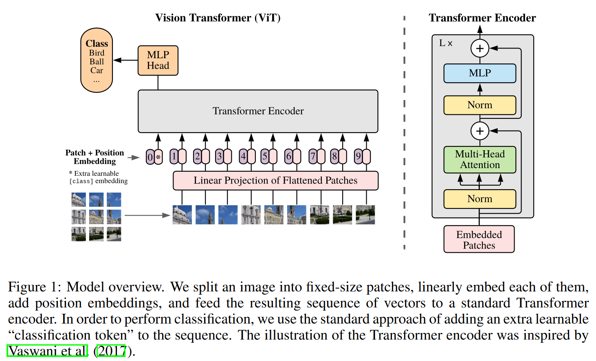
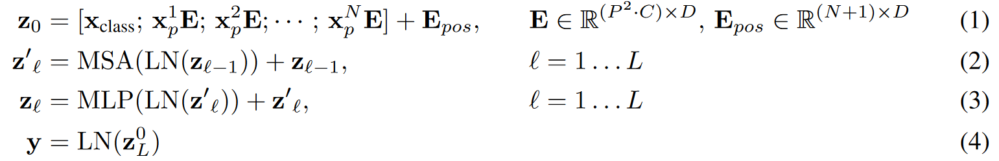
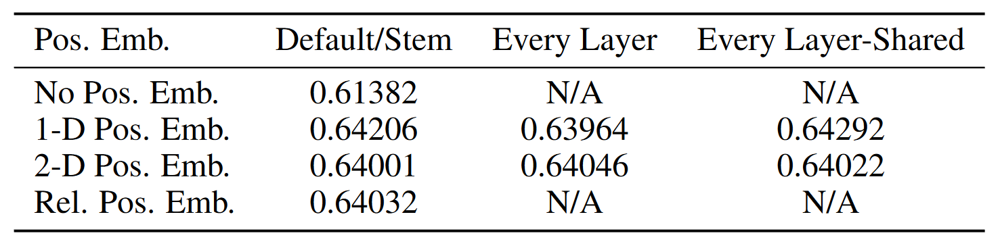
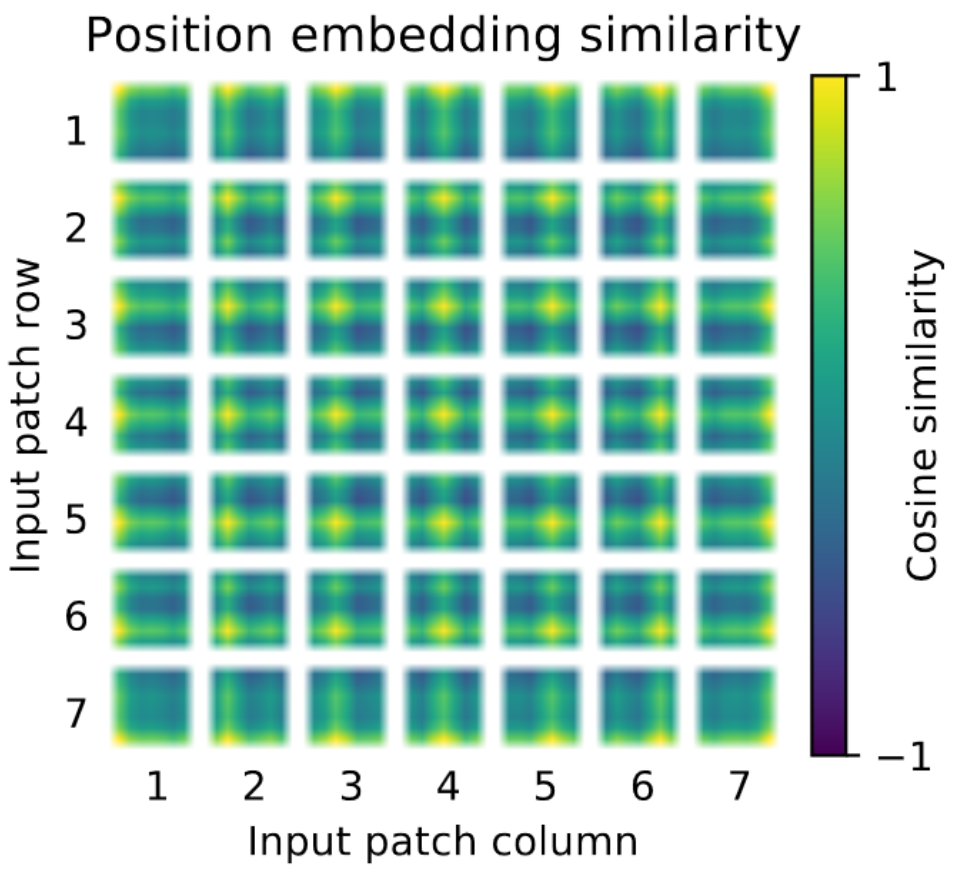
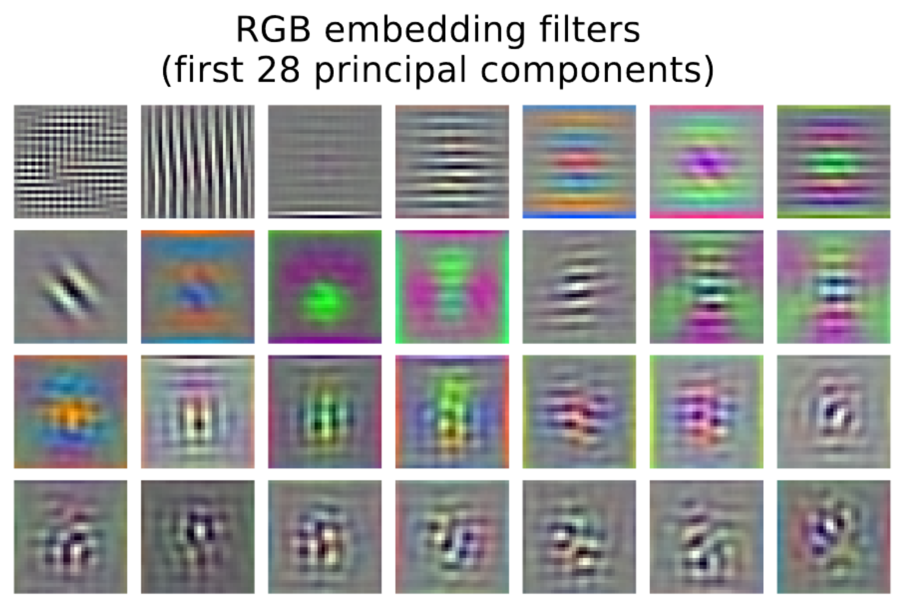
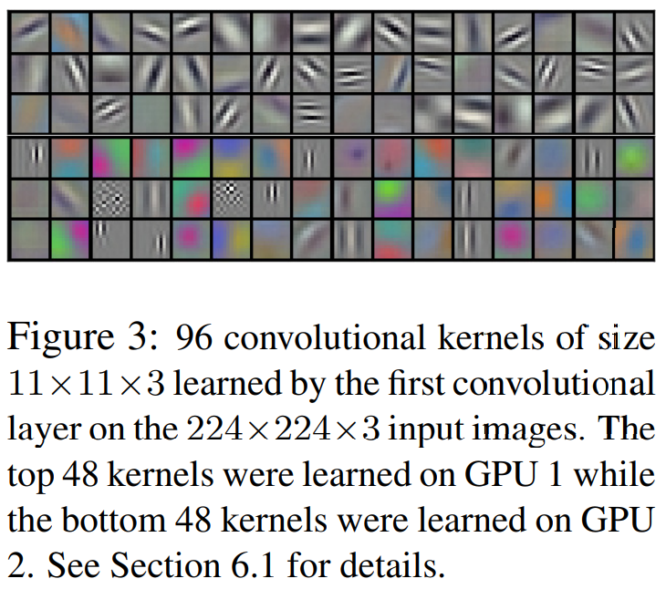
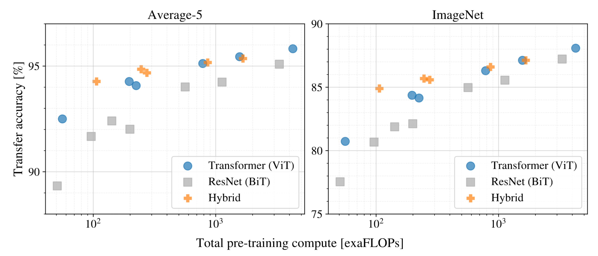
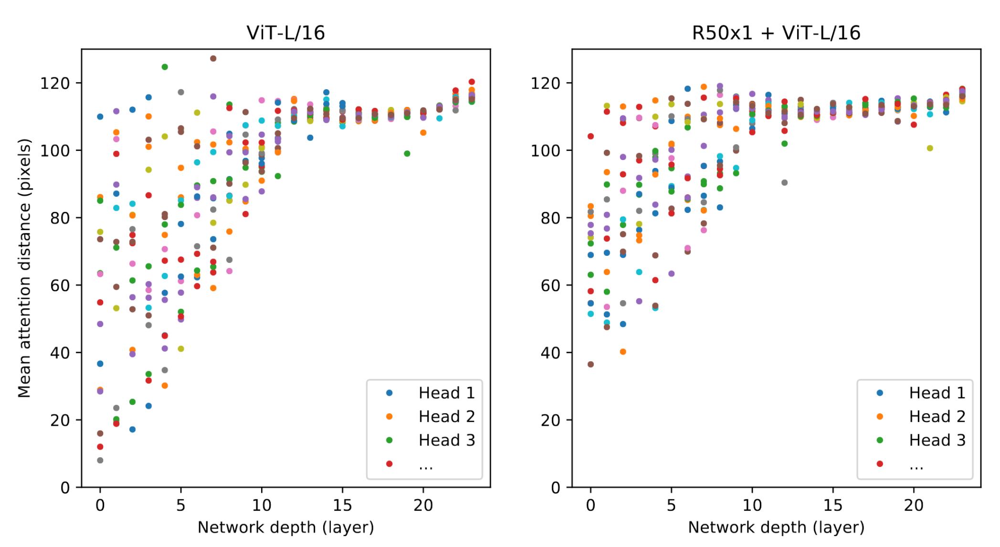
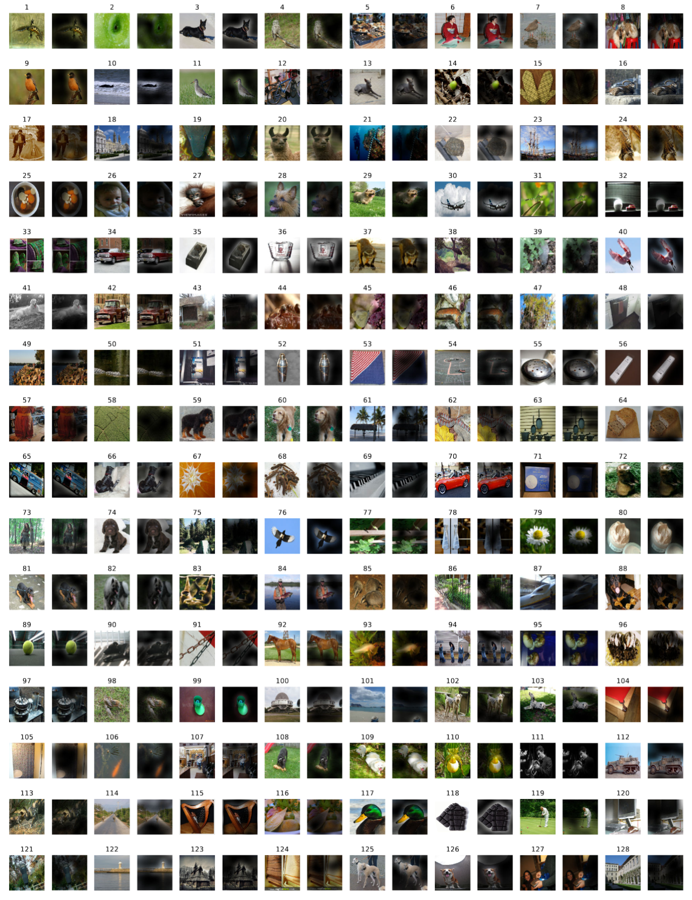
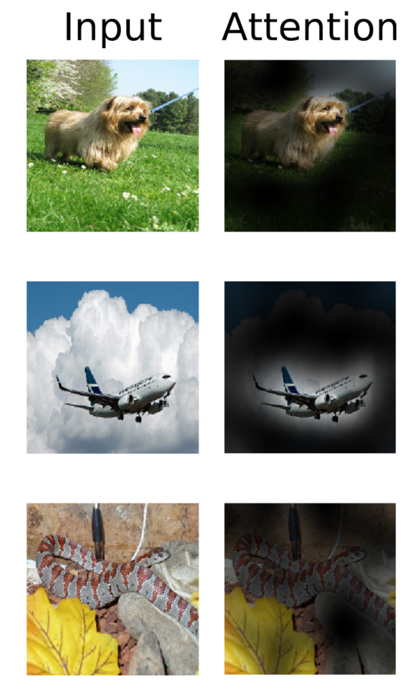

# Week 6 Vision Transformer论文笔记+复现

论文地址：[AN IMAGE IS WORTH 16X16 WORDS: TRANSFORMERS FOR IMAGE RECOGNITION AT SCALE](http://arxiv.org/abs/2010.11929)

上期回顾：[Week 5 Transformer](../Week5-Transformer/Week 5 Transformer.md)

## 简介

​		2017年之前，对于自然语言处理任务，循环神经网络是最受欢迎的模型，而对于计算机视觉任务，这一角色则由卷积神经网络扮演。但到了2017年，Transformer横空出世，使用注意力机制为基本模块，构造出了可并行处理时序数据的模型，将原本基于RNN的架构彻底推翻，以至于台大李宏毅教授的课程中已经不见了RNN的身影。

​		完全基于注意力机制的Transformer不随着序列长度的增加而丢失较早的信息，并且可以并行处理序列中所有的元素而无需顺序计算，将机器翻译等任务的精度和计算效率都提升了一个台阶。如此优越的模型，必然会引起CV界的高度关注。于是，2020年之前，有许多工作都聚焦于将注意力机制甚至整个Transformer应用于图像信息，但受制于实现的效率、模型的规模等一系列因素，它们都没能成为真正使Transformer在CV界跨界爆红的成果。

​		由于CV和NLP所处理的数据结构并不相似，并且任务也不尽相同，所以在CV和NLP两个领域都表现出色的模型屈指可数，并且都需要对模型进行大量的对应于领域的特定优化和修改。但本文所提出的Vision Transformer是反直觉的，作者明确表明，他们遵循的架构设计原则就是：**在原始Transformer上做尽量少的面向CV领域的特定优化和修改。**

## CNN的"inductive bias"

​		在此，我们回忆由多层感知机到卷积神经网络的进化动机：现如今，我们日常处理的图片尺寸都较大，如若用MLP处理图像信息，则需要将以三维张量存储的图像拉直成一个超长向量之后输入MLP中，这会导致每层神经元的个数极为庞大，较浅的网络也会包含动辄成百上千万个参数。

​		为了解决参数数量巨大、过拟合严重的问题，CNN应声而出。CNN有两个特性：**空间局部性**和**平移不变性**。

-   空间局部性是指与某一个像素有关的像素应该都与其相邻或相近，这样处理这个像素时就只需考虑其附近的像素即可，距其较远的像素与这个像素的关联可以忽略不计。这体现在卷积层中卷积核的大小通常较小，CNN主导图像处理的时代也少见大于11\*11的卷积核。
-   平移不变性是指某一种模式在图片的不同位置出现时，应当能用同一个检测器检测出来。这样，所需检测某种局部的模式，仅需设计一个面积较小的卷积核，则可在整张图片上复用多次以检测图片各处是否有符合这种模式的特征，大幅减小了参数数量。

​		这两条特性，是人们在面对图像处理信息的难题时，通过人的经验，以结构设计的方式注入模型的"归纳偏见"。然而我们知道，在某些图像当中，某些部分的信息确实与距其较远的像素有较大的关联。要想将距离较远的两处图像块综合起来，就需要将CNN堆叠多次，将感受野不断扩大到可覆盖整张原始图像方能做到。

## 模型架构

先上图：

​		如你所见，作者确实履行了他的诺言，除了嵌入层包含了视觉信息的"归纳偏见"外，中间的核心部分完完全全就是Transformer编码器，甚至位置编码和网络输出的方式都和BERT几乎无二。

### CV中的"tokenization"

​		众所周知，Transformer原本是给NLP任务设计的，而NLP任务的输入是一个序列，其中的每个元素都是一条向量。那图像咋办呢？答案藏在这篇论文的标题中："An image is worth 16x16 words"！作者将图片分成了许多分辨率为$P\times P=16\times16$的小"patch"，拉成一条长为16x16x3=768的向量之后当做NLP当中的单词处理。这一步可以看做是对图片的"tokenization"。

​		你可能会困惑，为什么向量能被当成单词？NLP中的单词不是还需要经过嵌入层转化成向量吗？现在图片patch已经是向量了还怎么转化？

​		答案是：将这个原始像素拉成的向量经过一个线性变换转化成长为$D=768$的向量，这个线性变换是可学的，并且对于所有图像patch中共享参数，称为"嵌入层"，也就是上面公式描述总体架构中的矩阵$\mathbf E$。这一步可以看做对图像向量的"embedding"，将图片转化成了待处理的向量，并且在将图片分割成小patch的过程中引入了"归纳偏置"（与空间局部性类似）。实际上，这个世界上本就没有词嵌入，有的只是输入为one-hot编码向量的线性变换。:grinning:

​		需要注意的一点是，由于序列长度与图片patch的边长的平方成反比，**所以patch越小，序列越长，计算量越大**。对于极限情况，$P=1$，即将每一个像素当成一个patch，这样就完全不包含图像信息的"归纳偏见"。但由于充当嵌入层的那个线性变换的输入维度是固定的，所以对于同一个模型，$P$确定之后，就不能再改变了。

### 位置编码

​		与BERT相同，作者抛弃了原始Transformer论文中的正弦位置编码，转而使用可学习的位置编码。作者试验了四种位置编码方式，下面一一介绍。

1.   完全没有位置编码；
2.   **(默认)** 1D位置编码，即对原图像中每个patch学出一个长为$D$的位置编码向量；
3.   2D位置编码，即对原图像中每行patch学出一个位置编码，每列patch学出一个位置编码，维度均为$D/2$；
4.   相对位置编码。对于两个patch A和B，有多种相对位置的情况，例如A在B上面，A在左上角B在右上角，等等。对于每种相对位置，学出一个位置编码向量，长度为$D$，$N$个patch共$N^2$个向量。然后，在Transformer编码器的自注意力层之前引入一个额外的注意力层，称为位置编码注意力。这个注意力层只有查询和键，查询即为原自注意力层的查询，但$N$个键为$N$个patch与当前查询patch的相对位置对应的位置编码向量。将查询和各个位置编码向量做缩放点积之后输出，不用SoftMax归一化。然后，在原自注意力层缩放点积，生成注意力分数之后，进入SoftMax转化成注意力权重之前，将位置编码注意力的输出当做偏置，和对应的注意力分数相加，在送进SoftMax，完成原自注意力的计算。

​		四种位置编码的效果如上图。另外，对于1D和2D位置编码，还有三种实现方式：

1.   **(默认)** 在进入Transformer编码器之前，将图片patch做线性变换之后，与位置编码向量相加；
2.   在进入每个Transformer编码器块之前，将位置编码与上一块的输出相加，每块前的位置编码独立学习权重；
3.   在进入每个Transformer编码器块之前，将位置编码与上一块的输出相加，各块前的位置编码共享权重。

​		从上表中可以看出，除了没有位置编码时精度较低之外，其他三个选项精度相仿，这是因为对于patch-level的输入来说，相比于pixel-level的输入，输入元素个数较少，学习它们的位置并不很困难。至于为什么作者最终选择了1D位置编码作为默认选项，原因可以用下图来解释：

​		这张图是从7x7=49个patch的位置编码中每次取出一个，与全部49个patch的位置编码计算余弦距离之后，按原来各个patch在图中的位置排好，因此上图中每个小格子都是一个7x7的矩阵，并且第$i$行第$j$列个patch中第$i$行第$j$列的元素一定为1，原因是自己和自己算余弦距离永远得1。

​		可以看出，一个patch的位置编码与当前patch距离较近的位置编码向量余弦相似度较高，并且同行同列的位置编码相似度也较高，所以可以得出结论：**1D的位置编码也能学得2D的空间信息**。

#### 微调时的位置编码

​		回忆原始的Transformer，作者不使用可学习的位置编码而是选择了正弦位置编码，原因之一就是可学习的位置编码在处理序列长度比大部分训练数据的序列长度要大的测试数据时会遇到困难，因为那些位置的位置编码可能仅仅被更新了几次，甚至完全没被更新过。

​		ViT的作者是如何解决这一问题的呢？在处理更大的图片时，patch size维持不变，patch数量增加，作者仅仅将原来的位置编码按照原来的patch的位置排列起来之后，**插值**到测试样本的图片大小后继续使用。这也是整个模型除了将图片分割成patch之外唯一人为将"归纳偏置"引入模型的部分。

### 可学习的分类标记和分类头

为了方便，再放一次整体结构图：

​		与BERT相同，Transformer编码器输入的第一个元素并非第一个patch，而是一个可学习的向量，记为\[class\]。整张图片经过ViT的处理，输出的第一个元素，也就是对应着输入\[class\]的那个输出被送入一个以tanh为激活函数的多层感知机做分类。在大数据集上与训练之后，将ViT应用于下游任务时，则将整个分类头移除，并接上一个权重初始化为0的全连接层作为分类头。

​		作者尝试过将\[class\]标记移除，并将所有patch的输出应用全局平均池化之后变成一个$D$维的向量，然后送进分类头里做分类，效果很差。但作者发现这是因为这两种方法所需的学习率不同。调整学习率之后，用\[class\]方法和全局平均池化的方法精度相仿，作者最终选择了BERT风格的\[class\]方法。

## 有趣的实验和图

### 嵌入层究竟学到了什么

​		上图是进入Transformer编码器前的线性变换$\mathbf{E}$的前28个主成分。这里再放上八年之前，也就是2012年发表的，让CNN一炮而红的奠基之作AlexNet中的图：

​		可以看到，这个嵌入层学到的模式和CNN几乎相同！可能这看起来是一个很自然的结果，但仔细想想，这还是蛮令人兴奋的：CNN和Transformer检测的是相同的图片低级特征，都能作为对原始图片做初步处理的"基函数"。

### 关于混合模型

​		作者在本文中不仅对ViT和传统CNN做了性能对比，还增加了对"混合模型"的测试。所谓混合模型，就是将图片送入ResNet后，在第四阶段的卷积层将14\*14的特征图取出，flatten成一个序列后加入位置编码，然后送入Transformer。这样，在浅层，网络拥有CNN引入的"归纳偏置"，但在深层网络又能通过Transformer将距离较远的特征建立联系，可谓是博采众长。

​		从上图来看，事实确实如此。在预训练较少时，混合模型展现出了超越CNN和ViT的性能，但在巨大的数据集上训练很久之后，ViT反超了混合模型。作者推测，拥有足够的训练样本之后，混合模型带来的"归纳偏见"对于模型来说就有害无利了，ViT完全可以通过自注意力机制将图片固有的性质学习出来。用原文的话来说，"**large scale training trumps inductive bias.**"

### 图像上的注意力

​		上图中每个点代表一个Transformer块中多头自注意力的一个头，纵坐标代表了这个头中所有query对各个key-value pair的注意力权重与query在图像中和对应key-value pair的距离的乘积的平均值，称为平均注意力距离：
$$
\frac{1}{num\_patch^2}\sum_{i, j}^{num\_patch} (\mathrm {dist}(patch_i, patch_j)\times |\mathrm{attention\ weight}(patch_i, patch_j)|)
$$
​		可以看出，浅层网络的注意力距离较短，这也合理，因为浅层语义性不强，这时网络处理的多是低级特征，而低级特征通常在图像中的面积较小，用CNN的话来说，"感受野小"；而深层网络的注意力距离普遍较大，这代表网络确实正在利用Transformer"无限感受野"的优势，正在从更远处抓取信息来处理当前patch。

​		对于混合模型来说，输入的就已经是低级特征抽得差不多了的特征图，所以浅层的注意力距离就比较大，这也说得通。

### 注意力图

​		右面这张图是将原图输入网络后，将每一层、每个头、每个query在各个key-value pair上的权重对应相乘得到的，可以看到网络已经学会了通过用自注意力层来挑选对分类有帮助的信息。

### 对自监督训练的尝试

​		作者看到了BERT能够自监督训练下获得很好的效果，于是也试了一把，将50%的patch做如下处理：以80%的概率替换为一个可学习的token：\[mask\]，10%的概率随机替换成另一个patch，10%的概率不变。随后，尝试了以下三种处理方法：

1.   预测目标patch的平均颜色。这里将预测任务人为地构造成了分类任务：将8-bit颜色降采样成3-bit后，三个通道共有$(2^3)^3=512$种组合，当成一个512类的分类任务做。
2.   将目标patch降采样成4x4分辨率，对每个像素预测3-bit颜色。
3.   用L2距离直接回归目标patch每个像素的颜色。

​		作者发现，前两种方法最后效果差不多，第三种方法稍微差一些。并且，自监督的方法并不需要JFT-300M这么大的数据集，JFT-300M上自监督的方式训练出来的模型和在ImageNet-1k上自监督训练出来的模型在下游任务中表现差不多。

​		尽管自监督的方式相比于直接在ImageNet上从头训练来说精度上升了2%，但距离有监督预训练的方式还是落后4%。

## 总结

​		这篇文章挖了个大坑，展现出了纯基于自注意力的模型在视觉任务中的无限可能，也对自监督训练视觉Transformer进行了初步探索。可以预见，这篇文章之后100%会有在巨大数据集上以纯自监督的方式训练的纯基于自注意力的模型出现。但是因为我还没学到，所以这里就不瞎扯了，等我学完了想起这一块再补。:-)

