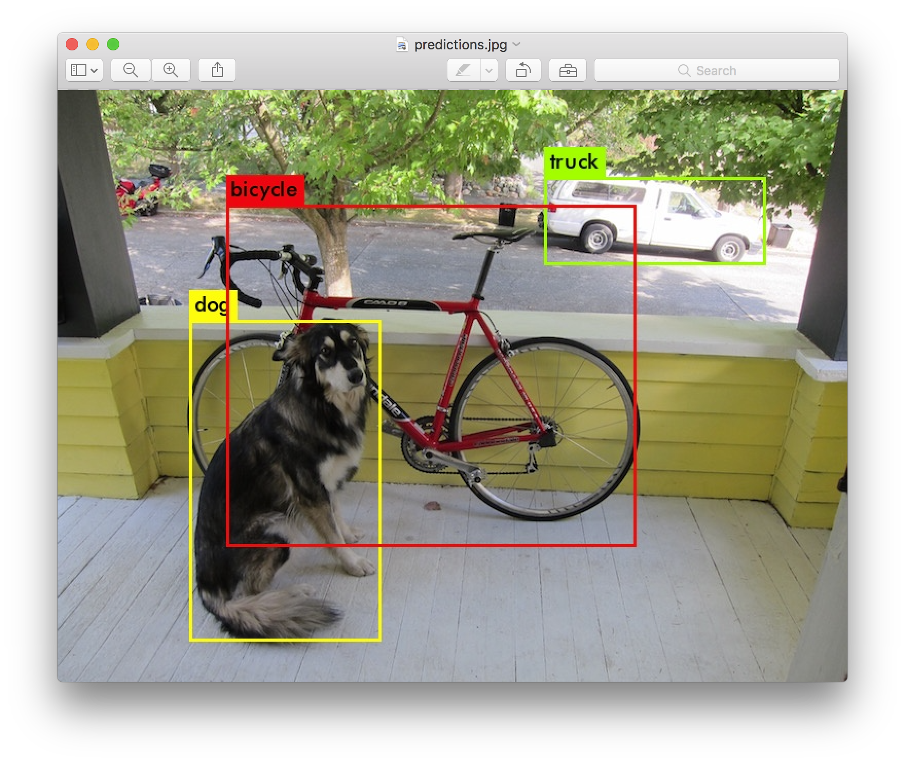
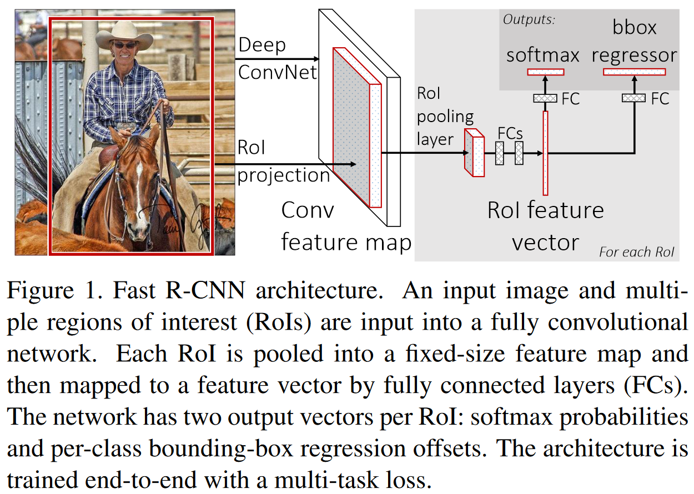

#  Week 7 R-CNN系列

原文地址：

-   [Rich feature hierarchies for accurate object detection and semantic segmentation](https://arxiv.org/abs/1311.2524)
-   [Spatial Pyramid Pooling in Deep Convolutional Networks for Visual Recognition](https://arxiv.org/abs/1406.4729)
-   [Fast R-CNN](https://arxiv.org/abs/1504.08083)
-   [Faster R-CNN: Towards Real-Time Object Detection with Region Proposal Networks](https://arxiv.org/abs/1506.01497)

上期回顾：[Week 6 ViT](../Week6-ViT/Week 6 ViT.md)

代码实现详解见[此处](./Faster R-CNN 代码.md)

## 一、目标检测任务简介

​		目标检测（Object Detection）是计算机视觉领域应用最为广泛的任务之一，目标是给定一张图片，标出图片中所有属于给定的几个类别之一的物体的位置和具体类别。

​		对于这样的一个任务，我们可以直觉地将其分为两个子任务：一是**找出图片中所有的物体**，二是**将找出来的物体进行分类**——这也是双阶段目标检测算法的核心思想：先找出图片中可能存在物体的大概位置，再对这些位置中是否存在物体进行进一步判断和分类，同时修正物体的位置。

### 名词解释

#### 几种框：

-   **Bounding Box**：边界框，指框住图片中物体的框，是一个广泛的指代，单独出现时通常指以下几种框之一：
-   **Predicted Box**：预测框，是模型的预测输出。
-   **Ground-Truth Box**：真实边界框，是数据集中每张图片的标签给出的边界框。
-   **Proposal**：候选框，或由如选择性搜索(Selective Search)等区域提议算法提出，或由锚框经修正得到，通常数量较多，准确性较差，需要被送至网络的其他模块作进一步筛选、修正。
-   **Anchor Box**：锚框，其面积与长宽比通常由人工设计或在数据集上统计得到，不随数据改变，其中心点的位置均匀分布在整张图片上，数量极大，通常能达几千个，是带锚框的目标检测算法输出候选框的基础，即候选框是由锚框经模型修正得到。锚框就像一个船锚一样，网络的候选框就像抛锚的船，只能在锚的附近移动，意味着候选框只能在锚框的基础上做有限的修改，并不会与锚框相差太远。

##### 框的表示方法：

​		一个边界框可以用四个数来描述其在图片上的位置（左上角为原点），常用的格式有三种：

-   xyxy：前两个数字为框左上角的x、y坐标，后两个数字为框右下角的x、y坐标。
-   xywh：前两个数字为框左上角的x、y坐标，后两个数字为框的宽和高。
-   cxcywh：前两个数字为框中心点的x、y坐标，后两个数字为框的宽和高。

#### IOU：

​		交并比(Intersection Over Union, IOU)是预测框和真实边界框相似程度的一种度量，计算方法如下图：

#### 选择性搜索(Selective Search, SS)：

​		一种使用图片的纹理、边缘、尺寸、颜色等低级特征，来筛选图片中可能含有物体的区域的算法，可以当做一个黑盒算法来使用。对于本文所介绍的各个算法，SS算法输出约2000~6000个**候选框**，数量与图片尺寸有关。关于SS算法提出候选框的具体方法见[这篇文章](https://zhuanlan.zhihu.com/p/140540615)。

#### 非极大值抑制(Non-Maximum Suppression, NMS)：

​		一种将冗余的预测框消除的算法。具体来说，给定**特定类别** $class=i$ 的预测框集合：

1.   NMS将所有预测框$Pred_*$按其置信度排序，得到包含所有预测框的有序集合$S_{i}=\{Pred_1, Pred_2,\ldots,Pred_n\}$，并创建一个用来放置被接受的候选框的空集合$T_i=\phi$。
2.   循环，直到$S_i=\phi$：
     1.   取集合中未被标记的预测框中置信度最高者$Pred_m$，$S_i=S_i\backslash\{Pred_m\}$，$T_i=T_i\cup\{Pred_m\}$；
     2.   对于所有$S_i$中剩余的检测框$Pred_j\in S_i$，若$\mathrm{IOU}(Pred_m,Pred_j)>IOU_{threshold}$，则将其从$S_i$中除去$S_i=S_i\backslash\{Pred_j\}$。
3.   输出集合$T_i$中所有的预测框。

​		注意：这个算法是对**各个类别**的预测框集合分别执行的！否则，对于重叠区域面积较大但类别不同的两个物体，应用无视类别的NMS后，模型仅会给出其中一个物体的预测框。

## 二、R-CNN

### 简介

​		R-CNN算法全名区域卷积神经网络(Region-Convolutional Neural Network)，是一种以卷积神经网络(CNN)抽取的特征为基础来进行目标检测的算法。R-CNN遵循传统目标检测算法的流程，将整个任务分为提出候选框 -> 对候选框内的图像提取特征 -> 分类 -> 预测框回归 四个部分。

### 1. 模型组成

1.   选择性搜索(SS)：提出候选框；
2.   CNN——AlexNet：抽取图片特征；
3.   分类器——N个二分类SVM：利用CNN抽取的特征对图片中的物体进行分类；
4.   回归器——N个岭回归：给定候选框、图片特征和类别信息，修正候选框。

注意：R-CNN中，每个类别拥有自己专用的分类器和回归器，不与其他类别共享。

### 2. 推理流程

1.   将图片送入SS算法，得到约**2000个候选框**$P$；

2.   将各个候选框在上下左右四个方向扩张p=16个像素，随后将其包住的图片拉伸成227x227，输入CNN中，取出最终全连接层的输出**特征a——4096维的向量**和最后一个池化层的输出**特征b——256x6x6的特征图**；

3.   将特征a送入N个SVM中，每个SVM给出**候选框中物体属于SVM对应类别的置信度**，取最高者作为本框中物体的类别；

4.   将特征b送入步骤3中所确定的类别对应的回归器中，得到4个输出：$d_x(P),d_y(P),d_h(P),d_w(P)$；这4个输出是**与候选框$P$的形状无关**的量。

5.   用如下公式分别计算cxcywh格式的预测框的四个参数（中心点x,y坐标和高宽）：

$$
\hat G_{cx}=P_w\sdot d_{cx}(P)+P_{cx}, \ \hat G_{cy}=P_h\sdot d_{cy}(P)+P_{cy}\\
\hat G_w=P_w\sdot \exp{(d_w(P))}, \ \hat G_h=P_h\sdot \exp{(d_h(P))}
$$
​		其中$P_w, P_h, P_{cx}, P_{cy}$分别是候选框的宽、高和中心点的x,y坐标，$\hat G_*$则是预测框的对应参数；
6.   **对各个类别的预测框分别应用NMS**。

### 3. 训练方法

#### CNN的训练

##### a. 预训练

​		使用在ImageNet分类数据集预训练AlexNet。预训练的目的：ImageNet上训练出来的CNN浅层所识别的特征较为通用，同样适用于ImageNet分类任务之外的其他许多任务，使用与训练的模型可以为模型的迭代更新提供一个较好的初始位置/初始条件，以此减小训练的轮次，缩短训练的时间。

##### b. 微调

​		CNN的微调目标：使得CNN抽出的特征更加适合做当前数据集的分类和回归。

1.   使用最后用于分类的4096x1000全连接层替换成4096x(N+1)全连接层，其中N为类别数量，并额外添加一个背景类，代表"这里什么也没有"。
2.   对于每张图片：
     1.   将图片送入SS算法，得到约2000个候选框。
     2.   **正负样本**：对于每个候选框，若存在一个真实边界框与其IOU大于0.5，则将这个候选框的类别标记为其对应的真实边界框的类别；否则标记为背景类。注意：正负样本都是图片上的候选框，而非图片分类任务中的图片！！
3.   构造批量：从所有图片的所有候选框中随机取出32个正类样本（类别不为背景）和96个负类（背景类）样本，构成一个含128个样本的小批量。注意，全部候选框的集合中，按上述正负样本的定义方法，正负样本的比例远不止如此，如果从其中直接均匀采样128个候选框，则背景类候选框拥有压倒性的数量优势，训练时会遇到严重的类别不平衡问题，以至于模型倾向于认为所有候选框中都不包含任何物体而将所有候选框都归为背景类。
4.   在对应图片上使用正负样本框框取其对应的图片后进行缩放拉伸，再将缩放拉伸后的图片块送入AlexNet，当做多分类任务进行训练。

#### 分类器——SVM（每类一个）的训练

##### a. 正负样本

​		训练集中图片的所有当前类别的真实边界框当做正样本，与当前类别的任意一个真实边界框的IOU都不大于0.3的候选框当做负样本。

##### b. 训练

​		将正负分类框分别向上下左右扩张16个像素之后将包住的图片块送入CNN，CNN输出4096维特征，用这些特征训练一个线性SVM分类器。

#### 边界框回归器——岭回归（每类一个）的训练

##### a.模型：岭回归

##### b. 输入、输出

-   输入：

    1.   训练样本：所有与**当前回归器对应的类别的真实边界框**的IOU大于0.6的候选框，记为$P$。
    2.   当前类别的真实边界框，记为$G$。
    3.   所有$P$所包住的图片块（已拉伸）输入进CNN后最后一个池化层的输出特征图，记为$\phi_5(P)$。

    注：$P=(P_{cx},P_{cy},P_w,P_h),G=(G_{cx},G_{cy},G_w,G_h)$。

-   输出：$d_{cx}(P),d_{cy}(P),d_h(P),d_w(P)$，结合候选框计算预测框：

$$
\hat G_{cx}=P_w\cdot  d_{cx}(P)+P_{cx}, \ \hat G_{cy}=P_h\cdot d_{cy}(P)+P_{cy}\\
\hat G_w=P_w\cdot \exp{(d_w(P))}, \ \hat G_h=P_h\cdot \exp{(d_h(P))}
$$

##### c. 训练

$$
\mathbf w_\star = \arg \min_{\mathbf {\hat w_\star}}\sum^N_i(t_\star^i-\mathbf {\hat w_\star}^\top\phi_5(P^i))^2+\lambda||\mathbf {\hat w_\star}||^2
$$

按上式直接求得闭式解。其中
$$
\star\in{\{cx, cy, w, h\}},\ \lambda=1000\\
t_{cx} = (G_{cx}-P_{cx})/P_w,\ t_{cy} = (G_{cy}-P_{cy})/P_h
\\
t_w = \log{(G_w/P_w)},\ t_h = \log{(G_h/P_h)}
$$
即：训练时是用真实边界框和候选框反推出与具体候选框尺寸无关的4个偏移系数，并作为回归目标；推理时使用回归器回归出这4个系数之后，使用这组系数修正候选框来得到预测框。

### 4. 评价

1.   贡献：

     放弃了手工特征，特征提取纯靠CNN；

     提供了将CNN在ImageNet上预训练后在目标检测数据集上做微调的思路；

     将深度学习和传统计算机视觉结合起来解决目标检测问题，为之后的改进工作留出了巨大的空间。

2.   优点：

     相比基于传统手工设计特征的方法精度较高。

3.   缺点：

     候选框提出、特征抽取、分类、回归四个任务使用了不同的模块来执行，整体性较差；

     对于每一个候选框，都需经历一次"扩张->拉伸->前向传播"的过程，一张图片约需执行两千次2000次上述过程，时间成本过高（47s per image）；

     各个模块的正负样本标记原则各不相同，训练流程复杂。

### 5. 结构图

## 三、SPP-Net

### 1. 动机

#### R-CNN的缺陷

对于每个候选框，R-CNN都需要经历一次前向传播。这包含两个步骤：

1.   将候选框扩张p=16个像素后，拉伸到固定高宽（227x227）；
2.   拉伸后的图片送入CNN，得到两个特征：全连接层的输出和最后一个池化层的输出，分别送入分类器和边界框回归器。

这样的处理方式导致了极高的时间成本。让我们来逐步分析这背后的真正原因：

-   SS产生的每个候选框的**面积、高宽比各不相同**；
-   卷积层和池化层可以接受任意尺寸的输入，但R-CNN采用了AlexNet模型，其卷积层和池化层的输出需要被展平(nn.Flatten())后进入全连接层，而**全连接层只接受固定长度的输入**；
-   这要求网络的每个卷积、池化层输出固定大小的特征图，也就意味着整个CNN只能接受固定大小的图像输入；
-   因此，R-CNN选择将候选框（扩张后）包住的图片经过拉伸操作后再送入CNN。这个**在原始图像上框取、拉伸**的操作，使得输入CNN的图像与原始图像的像素值产生了差异。即使两个候选框框住的内容几乎完全相同，仅在边缘处有微小的差异，但框取、拉伸之后，两框内图片的差异就会比拉伸前更大，网络必须进行两次独立的前向传播，得到两张不同的特征图，才能完成接下来的计算，而其中两框相同的部分的前向传播结果应当几乎相同，但却计算了两次。也就是说，**不同候选框之间的差异在CNN前向传播之前就被框取和拉伸操作引入了**。这就是R-CNN效率低下的罪魁祸首。

#### SPP-Net的改进

​		那么，有没有一种可能，可以将对特定候选框的操作延后到CNN做完特征提取之后进行，使得各个候选框能够共享相同的特征提取过程呢？

​		一个直观的想法是：我们是否能**在CNN输出的特征图上框取我们所要处理的区域，而不是直接在原始图像上框取**呢？这样，整张图片就**仅需一次CNN的前向传播**，其后对每个特定候选框的操作在同一张特征图上进行即可。当然，经过数个下采样层，特征图的尺寸相较于原始图像肯定会大大减小，所以在特征图上框取之前，我们需要一种方法，将框在原图上的候选框映射到框在特征图上的"候选框"。

​		但这样做只解决了一个问题——特征抽取的计算不共享。另一方面，全连接层只接受定长输入——这点从未改变。因此，框取出候选框对应的特征图区域之后，还需一种方法，**将不同候选框框出的不同尺寸的特征图，变换成统一长度的特征表示**。

### 2. 模型组成

​		SPP-Net的目标检测模型仍由SS、CNN、SVM和岭回归这四个部分组成，仅多了以下两个模块：

#### 将候选框从原始图片投影到特征图上

​		SPP-Net在目标检测上的推理速度远远快过R-CNN，这都归功于其对于每张图片仅需前向传播一次。为了将"用候选框来框取"这个操作延后到特征提取后进行，我们需要将SS算法产生的**候选框从原始图片映射到CNN输出的特征图上**。

​		给定一个候选框和原图输入进CNN输出的特征图，SPP先计算特征图上每个像素的感受野在原始图像上的中心，并将候选框的四个角分别映射到据其最近的感受野中心对应的特征图上的像素。

​		这样，就将候选框从原始输入图像映射到了特征图上，使用原候选框的坐标在原图片上裁剪图片块的操作就可被使用映射后的候选框的坐标在特征图上裁剪特征图块来代替。需要特别注意的是，由于最后一个卷积层输出的特征图的感受野较大，因此裁剪出来的特征图其实不仅包含了原图像上候选框内的像素的信息，也包含了原图上候选框外部分像素的信息。

#### 空间金字塔池化层(Spatial Pyramid Pooling Layer, SPP Layer)

​		接下来，我们看上面的第二个问题——将不同候选框内包含的特征图上的值转化成统一长度的特征表示。作者提出的空间金字塔池化层，不同于普通的池化层，它接受任意大小的特征图输入，并输出一个固定长度的向量，使得任意大小的特征图块都能够被正确地输入之后的全连接层。

​		具体而言，对于给定候选框对应的一块特征图，SPP层用 $l$ 种网格将其均匀分割成n\*n的窗口，随后对于每个网格中的每个窗口做最大池化，最后将所有网格的池化结果拼接起来。

​		例如上图中，给定一块特征图，SPP层用$l=3$种网格将其分别均分为4\*4、2\*2、1*1个窗口，在每个窗口中做最大池化，将所有窗口中的最大池化结果拼接起来，输出一个长为(4\*4+2\*2+1\*1)\*256(特征图通道数)的向量。

### 3. 推理流程

​		SPP-Net的推理流程与R-CNN几乎相同，仅特征抽取和框选的顺序相反：

1.   将图片送入CNN中，得到最后一个卷积层输出的特征图；
2.   将图片送入SS算法，得到约2000个候选框$P$；
3.   将各个候选框从原图投影到特征图上，送入SPP层；
4.   对每个候选框，取出最终全连接层的输出**特征a——4096维的向量**和最后SPP层的输出**特征b——SPP层的输出**（此处SPP使用1\*1、2\*2、3\*3、6\*6四种网格，共50个窗口）；
5.   将特征a送入N个SVM中，每个SVM给出候选框中物体属于对应类别的置信度，取最高者作为本框中物体的类别；
6.   将特征b送入步骤3中所确定的类别对应的回归器中，得到4个边框修正系数；
7.   用边框修正系数修正候选框，得到预测框；

8.   对各个类别的预测框分别应用NMS。

### 4. 训练方法

​		SPP-Net的推理流程与R-CNN也几乎相同：

#### 预训练CNN

​		与R-CNN相同，将CNN在ImageNet上用分类任务做训练。

#### 微调CNN

​		预训练过后，与R-CNN不同，SPP-Net将最后一个池化层（包含）之后的所有层都丢弃，拼接上两个全连接层：第一个接受SPP的固定长度的输出作为输入，第二个输出N+1个类别置信度。

​		随后，**锁定卷积层的参数，只微调新初始化的全连接层**。

SVM分类器和边界框回归器的训练方式与R-CNN相似。

### 5. 多尺寸训练、推理

​		SPP-Net尝试了单尺寸、多尺寸的训练和推理方法：

##### 单尺寸

​		与R-CNN相似，将所有图片统一缩放到短边$s=688$后送入R-CNN抽取特征。

##### 多尺寸训练

​		将各个图片缩放至短边为$S=\{480, 576, 688, 864, 1200\}$中的一个随机值，前向传播，完成训练，可以看做一种数据增强的方法，使得网络具有缩放不变性。

##### 多尺寸推理

​		将各个图片分别缩放至短边尺寸$s\in S=\{480, 576, 688, 864, 1200\}$，对每个尺寸分别前向传播，随后对于每个候选框，计算其面积，选择候选框面积与$224^2$最接近的$s$对应的特征图进行框取。如果候选框的宽高比接近1:1，那么这样的方法就和R-CNN中将候选框内的图片缩放为224x224类似了。只不过R-CNN在原图上框取、拉伸的操作是通过手动将候选框扩张16个像素来引入候选框周围的信息的，而SPP-Net的方法中，由于被框取的特征图中每个像素的感受野都较大，特征图中位于候选框边缘的像素本身就包含了候选框周围的信息。

### 6. 评价

1.   贡献

     部分解决了R-CNN训练、推理时间成本巨大的痛点，提供了用候选框在特征图上而非原始图像上框取的思路；
     
2.   优点

     推理速度比R-CNN快了百倍，同时精度不减。

3.   缺点

     CNN、SVM、岭回归仍是分别训练的，没有融合成一个整体；

     微调SPP层之后的全连接层时，前面的CNN的参数锁定，没有一起训练，影响了模型性能。

### 7. 结构图

## 四、Fast R-CNN

### 1. 动机

R-CNN和SPP-Net的缺陷：

1.   二者都采用多段式模型，训练、推理流程复杂，正负样本定义各不相同，不够统一、简单；
2.   SPP-Net在微调时没能将卷积层的参数一起更新，损失了精度。

能不能直接使用一个网络就完成物体分类和预测框回归的任务呢？

### 2. 模型架构和推理流程

​		整个Fast R-CNN**仅由两个部分组成**：SS和一个神经网络，其具体结构如下：

#### 卷积层：抽特征

​		Fast R-CNN使用VGG-16当做backbone，输入进一张任意大小的图片，输出一张特征图。

#### 感兴趣区域池化(Region Of Interest Pooling, ROI Pooling)：

​		ROI Pooling层是仅有一种网格的SPP层，将**输入的任意尺寸特征图池化到固定尺寸后拼接在一起并输出**。

#### 输出层：物体分类，预测框回归

​		特征图经过ROI Pooling层后成为固定长度的向量，经过两个全连接层之后，分成两路：

-   一路送入Softmax分类层，输出N+1个类别的置信度（N个物体类+1个背景类）；
-   一路送入预测框回归层，输出4xN个偏移系数，每类4个，根据分类层的输出，取对应类的偏移系数，按与R-CNN相同的方式对候选框进行修正。

​		最后送入NMS消除冗余预测框。

### 3. 训练方法

#### 批量构造

##### 改变采样策略以减小训练开销

​		与R-CNN和SPP-Net不同，训练Fast R-CNN的一个批量中的$R=128$条数据仅来源于$N=2$张图片，每张图片$R/N$张，而不是像R-CNN和SPP-Net一样，由SS算法预先计算出所有的图片的候选框后，对这个包含所有图片的所有候选框的集合采样。

​		由于上述两个算法在构造小批量时都分别对正负样本集合均匀采样，故对于大部分情况，整个批量中所有的候选框都几乎各来源于不同的图片，每张图片都需要将图片前向传播并记录中间结果，一个批量的前向传播次数就约等于批量大小。而SPP的优点就在于对于同一张图片中的所有候选框，仅需前向传播一次，这样的采样策略使得每个预测框都需经历一次前向传播，这无疑在训练阶段完全埋没了SPP的优势。

​		对于固定的批量大小 $R$，若将图片数$N$调得比较小，就会有许多预测框来源于同一张图片，这些来源于同一张图片的预测框就可以共用同一张特征图，而无需对每个预测框各自独立地进行前向传播，卷积层的前向传播次数就等于$N$，发挥出了ROI Pooling/SPP的优势，节省了前向传播的时间；

​		同时，这些预测框的前向传播过程仅在所有卷积层的计算都结束了之后才会开始产生差异，梯度在反向传播时就可以在最后一个卷积层的输出处出累加到一起，再共同计算backbone CNN中卷积层的参数的梯度，节省了反向传播的时间。

​		注意：理论上来讲，一个批量中的样本应当满足独立同分布条件，但作者测试下来，这样的训练方法虽然使得批量内样本之间的关联性较大，但也不影响网络的收敛。

##### 正样本

​		用于训练网络的正样本被定义为：那些与某个真实边界框的IOU大于0.5的候选框，其类别就标记成对应的真实边界框的类别，每张图片采样16个候选框，即正样本占比25%；

##### 负样本

​		用于训练网络的负样本被定义为：那些与所有真实边界框的IOU的最大值在区间$[0.1,0.5)$内的候选框，类别标记为背景，每张图片采样48个候选框，即负样本占比75%。

##### 数据增强

​		仅以0.5的概率水平翻转，无其它数据增强手段。

#### 多任务损失函数

​		能够同时训练网络的特征抽取器、分类器和预测框回归器——而不是分别单独训练——是Fast R-CNN的卖点之一。

​		网络输入进一张图片和候选框$P$之后，给出$K+1+4K$个输出，其中包含$K+1$个类别置信度和$4K$个偏移系数。规定符号：这个候选框$P$的真实类别为$u$，网络在类别$u$上输出的置信度为$p_u$，在类别$u$上输出的偏移系数为$d_\star^u(P)$，$P$到其对应真实边界框的偏移系数为$t_\star$，其中$\star \in \{cx, cy, h, w\}$，且$t_\star$和$d_\star^u(P)$仅在$P$是正样本时才有意义。注意，Fast R-CNN原论文中的符号规定和R-CNN中有所不同，这里为了阅读流畅，沿用了R-CNN的符号规定，阅读原论文时应当特别注意。本文所用的损失函数为：
$$
L(p_u, u, d_\star^u(P),t_\star)=L_{cls}(p_u,u)+\lambda[u\ge1]L_{reg}(d_\star^u(P),t_\star)
$$
​		其中指示函数$[u\ge1]$代表仅当候选框$P$是正样本时才对修正后的候选框与真实边界框的偏差加以惩罚，因为若$P$为负样本则不存在一个真实边界框与之对应，也就没有回归目标。此外，$\lambda=1$，$L_{cls}$为标准的交叉熵损失函数$-\log{p_u}$，$L_{reg}$为smooth L1 Loss：
$$
\mathrm{smooth}_{L_{1}}(x)=\begin{cases}0.5x^2,& \mathrm{if} \ |x|\le1
 \\
|x|-0.5, & \mathrm{otherwise}
\end{cases}
$$
​		这样的L1 Loss相比于R-CNN和SPP中回归预测框所用的L2Loss而言，对离群值和学习率的敏感性更低。

#### 训练流程

​		使用在ImageNet图像分类任务中预训练好的CNN，删除其最后一个池化层及其之后的部分，作为backbone，在其后拼接ROI Pooling层和带两个分支的输出层。

​		然后，使用多任务损失函数对整个网络直接进行训练。

### 4. 评价

1.   贡献：

     将特征抽取器、分类器和预测框回归器合并成一个网络，提高了网络的整体性、推理速度和精度；

     在网络训练完成后使用SVD将全连接层低秩分解，进一步提高推理速度；

     首次在批量中大量使用来自同一张图片的样本，在训练阶段发挥出了ROI Pooling共享计算的优势，降低了训练开销；

     使用smooth L1 Loss替代L2 Loss，提高了模型的鲁棒性。

2.   优点：

     模型的整体性迈上了新的台阶，并且multi-task Loss使得网络的各个部分能够相互影响，有利于提高精度；

     由于损失函数仅有一个，正负样本定义简单，流程简洁。

3.   缺点：

     推理速度仍受SS算法制约，**没能将提出候选框这一操作整合进网络结构中**以使用GPU加速这一过程。

### 5. 结构图

## 五、Faster R-CNN

### 1. 动机

​		Fast R-CNN虽然看上去很快，但实际上其报告的速度都没有包含使用SS算法计算候选框的耗时。事实上，SS算法从一张图片中提取候选框这一过程在CPU上的耗时接近2秒。有人可能会想：能不能将SS算法移植到GPU上进行呢？

​		不是不可以。SS算法提出候选框的依据是图片的低级特征。一个很自然的想法是：SS算法既然依据图片的特征提出候选框，而Fast R-CNN中已经包含了用于提取图片特征的CNN backbone，那么何不开发另一种算法，能够根据Fast R-CNN中卷积层所提取的特征来提出候选框，并在GPU上高效地运行呢？

​		Faster R-CNN就通过提出一个利用CNN输出的特征图来提出预测框的算法——区域提议网络，解决了预测框的提出制约网络推理速度的问题，并且将预测框的质量与CNN抽取的特征质量直接关联起来，意味着更好的特征就能产出更精确的预测框。

### 2. 模型架构

#### CNN backbone

​		可选各种网络结构，用于抽取特征。

#### Fast R-CNN

​		下文中Fast R-CNN指的是Fast R-CNN拆掉前面backbone CNN之后剩余的部分，包含：ROI Pooling，FC层，和两个分别负责分类和回归预测框的分支。

#### 区域提议网络(Region Proposal Network, RPN)

​		回想上文所述的算法，都是由SS算法给出候选框后，模型在候选框的基础上结合CNN抽取出的特征对候选框进行修正。本文与前述算法不同，先基于预先设置好的、长宽固定的锚框，经过RPN的初步修正成为候选框，再送入Fast R-CNN经过进一步修正成为预测框。

​		RPN作为SS算法的替代品，以CNN输出的$B\times C\times H\times W$特征图为输入，并在特征图每个位置上预置$K$个锚框，共$H\times W\times K$个。这$H\times W$个位置上的锚框是相同的，但单个位置上的$K$个锚框是不同的。RPN对所有位置的所有锚框各输出1个物体分数(Objectness)——代表"这里有物体"的概率，和4个用于将锚框修正成候选框的偏移系数。使用偏移系数将其对应的锚框进行修正后，RPN就预测出了$H\times W\times K$个候选框，经过NMS消除冗余后送入Fast R-CNN中。本文在锚框的选择方面使用了3种长宽比$\{2:1,1:1,1:2\}$和3种面积$\{128^2,256^2,512^2\}$，组合出了$K=9$种锚框。

​		RPN接受到backbone CNN输出的特征图后，先对其进行3x3卷积，输出通道数为256，stride=1，padding=1，将结果送进两个分支中。负责预测物体置信度的分支进行1x1卷积，输出通道数为$K$；负责预测4个偏移系数的分支也对其进行1x1卷积，输出通道为$4K$。也就是说，$K$个锚框的Objectness预测和偏移系数的回归各自使用不同的权重。

​		RPN输出偏移系数后，需要使用下文列出的公式反算出候选框的坐标和尺寸，再送入Fast R-CNN中。

### 3. 训练方法

#### RPN的训练

​		记$t_\star$为RPN的输出，$t_\star^*$为锚框和真实边界框经过计算得出的真实偏移系数（标签），其中$\star\in\{cx,cy,h,w\}$，
$$
&t_x = (cx − cx_a)/w_a, \ &t_y = (cy − cy_a)/h_a,\\
&t_w = \log{(w/w_a)}, \ &t_h = \log{(h/h_a)},\\
&t_x^* = (cx^* − cx_a)/w_a, \ &t_y^* = (cy^* − cy_a)/h_a,\\
&t_w^* = \log{(w^*/w_a)}, \ &t_h^* = \log{(h^*/h_a)}
$$
​		正确理解上面四行公式是理解RPN训练方法的关键。上面两行是人为规定的RPN的输出的含义，用于利用RPN的输出反推出RPN预测的候选框坐标，下面两行是由真实边界框和锚框计算得到的标签。RPN的损失函数如下：
$$
\mathcal L(\{p_i\}, \{t_i\})=&\frac{1}{N_{cls}}\sum_i L_{cls}(p_i,p_i^*)\\
&+\lambda \frac{1}{N_{reg}}\sum_i p_i^*\ L_{reg}(t_i, t_i^*)
$$
​		其中，$L_{cls}$为交叉熵损失，$L_{reg}$为smooth L1损失。对RPN的训练是为了使得锚框经RPN修正后的预测框与真实边界框尽量地接近，使得其后的Fast R-CNN能够准确地找到图像中的物体，并在候选框的基础上做尽量小的修正来得到预测框。

##### 批量构造

​		训练RPN所用的一个批量的样本均来自于同一张图片，批量大小为256，其中：

###### 正样本定义为：

1.   对于每个真实边界框，与其IOU最大的那个锚框。这类正样本数量与真实边界框的数量相等；
2.   和任意一个真实边界框的IOU大于0.7的锚框。若某锚框与数个真实边界框的IOU都大于0.7，则将其分配给与其IOU最大的那个真实边界框。

###### 负样本定义为：

​		和任意一个真实边界框的IOU都不大于0.3的锚框。

​		既不被归为正类样本，也没被归为负类样本的锚框不参与训练，直接忽略。正负样本比例为1:1，每个小批量中均为128个。

#### Fast R-CNN的训练

​		Fast R-CNN部分的训练与Fast R-CNN原论文提出的训练方法完全相同。

#### 4阶段交替训练

​		准备工作：在ImageNet上预训练出一个CNN，去掉全连接层，仅保留卷积层，复制成两份，记为CNN-1和CNN-2。

##### Step1.

​		将CNN-1和RPN拼接起来，形成一个完整的候选框提出模块\[CNN-1, RPN\]，按本节开头所述方法训练，其中**CNN-1的参数不固定**，在训练后发生改变，记为\[CNN-3, RPN\]。

##### Step2.

​		用\[CNN-3, RPN\]当做黑盒候选框提出器来产生候选框，将CNN-2和Fast R-CNN拼接起来，形成一个完整的目标检测模块\[CNN-2, Fast R-CNN\]，使用和Fast R-CNN相同的方法训练，其中**CNN-2的参数也不固定**，训练后发生改变，记为\[CNN-4, Fast R-CNN\]。

##### Step3.

​		用CNN-4代替CNN-3，组成新的候选框提出器\[CNN-4, RPN\]，**固定CNN-4的参数不变**，用RPN训练方法微调RPN。

##### Step4.

​		用Step3.中微调好的\[CNN-4, RPN\]当做黑盒候选框提出器来产生候选框，使用和Fast R-CNN相同的方法训练\[CNN-4, Fast R-CNN\]，**固定CNN-4的参数不变**，微调Fast R-CNN独有的层。

### 4. 推理流程

1.   将图片送入backbone CNN，得到特征图$C\times H\times W$；
2.   将特征图送入RPN，得到$H\times W\times K$个候选框；
3.   将候选框送入NMS，消除冗余候选框；
4.   将NMS筛选后的候选框送入Fast R-CNN，执行Fast R-CNN的前向传播流程，对候选框做进一步修正，并打上类别标签。

### 5. 评价

1.   贡献

     使用RPN替代了SS算法来提出候选框，加快了候选框提出的速度，大大增加了R-CNN系列算法的实时性；使用CNN抽取出来的特征来提出候选框，将候选框的质量与backbone CNN抽取出的特征的质量联系起来，为后续通过使用更好的backbone CNN来提升网络的性能创造了可能。

2.   优点

     推理速度相对较快，不需要使用SS预先计算候选框。

3.   缺点

     整个模型仍分为两个部分，RPN和Fast R-CNN无法使用一个损失函数统一训练。

### 6. 结构图

## 六、结语

​		双阶段目标检测算法是最早将深度学习技术引进目标检测任务的算法，其基本思想沿袭了传统计算机视觉工具解决目标检测问题的方法，这类算法时间开销大，结构复杂，超参数繁多，但精度较单阶段检测算法更优。R-CNN系列是双阶段检测算法中最为经典的一个系列，学习R-CNN系列算法对理解其他双阶段目标检测算法乃至单阶段目标检测算法都有帮助。

​		这篇文章是作者在阅读相关论文、学习代码的过程中陆续完成的，整理了一些对于实现算法较为重要的细节，希望可以帮助到想要入门目标检测算法的小伙伴们。作者能力有限，文章中如有谬误或与原论文出入较大之处，欢迎各位看官批评指正！
